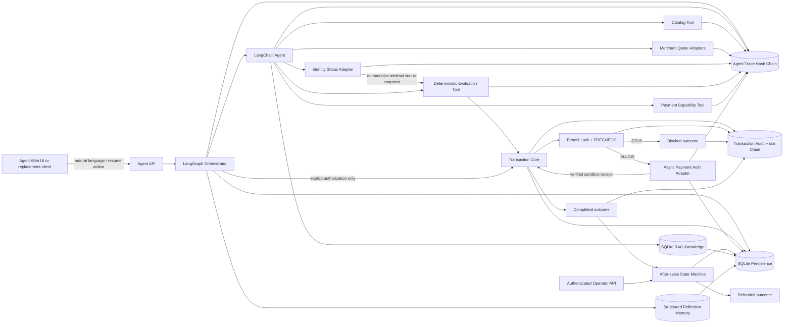

# CampusCart MVP Architecture

## 总体边界



LLM 没有授权、Benefit Lock 或付款工具。浏览器和 LangGraph 都不能生成 ALLOW；它们只能要求交易核心执行确定性转换。商户、身份与支付接口均为 `async`，以便将来替换成 API、redirect、SDK token、deep link 或 webhook。

## 两种不同的状态

LangGraph 是工作流状态：它管理工具顺序、外部等待、用户批准、支付认证恢复和可见轨迹。

```text
discovery
  ├─ unsupported product → request rejected; no transaction
  ├─ missing/invalid budget or ambiguous input → NEEDS_CLARIFICATION; compare-only
  ├─ no eligible / within-budget plan → BLOCKED; no authorization
  → wait_for_authorization [interrupt]
  → authorize_and_precheck
      ├─ BLOCKED → finish
      └─ ALLOW → prepare_payment
                  → wait_for_payment [interrupt]
                  → complete_payment → finish → reflect
  ↘ reject / auth failed / runtime error → cancel transaction → finish
```

交易状态机是安全状态：它保护授权金额、规则版本、单次使用、幂等和支付前条件。

```text
DRAFT → OPTIONS_EVALUATED → USER_AUTHORIZED → BENEFIT_LOCKED
      → PRECHECK → PAYMENT_AUTH_REQUIRED → PAYMENT_EXECUTED → COMPLETED
                 ↘ BLOCKED
      ↘ NEEDS_CLARIFICATION
      ↘ CANCELLED
      ↘ EXPIRED
COMPLETED → REFUNDED [separate after-sales confirmation or received return]
COMPLETED → exchanged_sandbox [operator-approved replacement evidence]
```

两者不应合并。即使未来更换 Agent framework 或模型，交易状态机仍是唯一资金动作权威。

## 工具权限

| 工具 | 数据源 | 权限 | 是否可触发支付 |
| --- | --- | --- | --- |
| `search_supported_products` | Merchant registry | 只读 | 否 |
| `fetch_merchant_quotes` | Merchant adapters | 只读、并发 | 否 |
| `inspect_student_eligibility` | Identity adapter | 只读、最小化 | 否 |
| `evaluate_checkout_options` | Deterministic core | 可创建评估 session | 否 |
| `list_payment_methods` | Payment adapter | 只读 capability discovery | 否 |
| `inspect_current_decision` | Run + transaction snapshot | 只读问答依据 | 否 |
| `retrieve_campuscart_knowledge` | SQLite FTS5 knowledge store | 只读、带来源 | 否 |

`create_payment_authorization_session` 与 `confirm_payment_authorization` 不暴露给 LLM；仅 LangGraph 在确定性预检通过后调用。这样 tool-calling prompt 被攻击或模型输出错误时，也无法越过 Benefit Lock。

## 异步与人工确认

每个 Agent run 有稳定 `thread_id`。LangGraph 的 `interrupt()` 返回一次性 `actionId`：

1. `purchase_authorization`：返回合规方案列表，由用户选择一个方案并绑定最大现金金额；
2. `payment_authentication`：绑定 payment session、支付方式和金额。

客户端通过 `POST /api/v1/agent/runs/:id/resume` 恢复。支付动作必须同时匹配 `runId + actionId + paymentSessionId`；过期动作将 transaction 设为 `EXPIRED` 并关闭锁。Agent run、交易、支付认证会话和 LangGraph checkpoint 共用 SQLite，因此两次人工确认都可跨服务重启恢复。真实 provider 仍必须由验签 webhook 恢复图，而不是相信浏览器自行声称“认证成功”。

## RAG 与经验记忆边界

SQLite 保存来源化知识文档、chunk 与可选 embedding。默认使用 FTS5 加词法匹配；显式配置 embedding provider 后，缺失向量会分批建立并持久化，查询采用词法与 cosine 排名融合。Embedding 服务失败会降级为词法检索。模型可用检索结果回答目录、权益、安全和支付政策问题，但检索文本不能进入金额、资格、Benefit Lock 或付款判定。

每个终态 run 经过独立 `reflect` 节点，写入结构化 episode：结果、原因码、证据摘要和经验。episode 带 verified/candidate/rejected 质量状态、召回次数和用户反馈；`unhelpful` 会阻止后续召回。episode 只允许影响澄清策略、工具路由和解释；禁止影响价格、预算、资格、授权和资金动作。它不是模型自动改规则或在线训练。

## 售后状态机

售后与购买图分离，通过 `/api/v1/after-sales/cases` 创建：

```text
REQUESTED → ELIGIBILITY_CHECKED
  ├─ refund / cancel_order → USER_CONFIRMATION_REQUIRED → REFUND_PENDING → REFUNDED
  ├─ return → MANUAL_REVIEW
  │            ├─ reject → REVIEW_REJECTED
  │            └─ approve → RETURN_AUTHORIZED → RETURN_RECEIVED → REFUNDED
  ├─ exchange → MANUAL_REVIEW
  │              ├─ reject → REVIEW_REJECTED
  │              └─ approve → EXCHANGE_AUTHORIZED → COMPLETED
  └─ outside policy window → REJECTED
```

退款确认使用独立、一次性、会过期的 action。人工审核通过独立 `/api/v1/operator/*` 路由执行；未配置 `CAMPUSCART_OPERATOR_API_KEY` 时路由关闭并返回 503，错误密钥返回 401。Bearer token 使用固定长度 SHA-256 digest 做常量时间比较。后台写操作需要幂等键和合法前置状态，审核者 ID、角色和结果写入 service-case hash chain。沙箱退款会更新 payment/order 状态、恢复积分证据，并追加 transaction audit 与 service-case audit；模型没有退款或 operator 工具。

## 支付顺序与 TOCTOU 防护

```text
user approves plan
  → create Benefit Lock
  → final quote + rule PRECHECK
      → fail: BLOCKED (no payment session exists)
      → pass: PAYMENT_AUTH_REQUIRED
          → create provider auth session
          → external user authentication
          → re-fetch/recheck quote and lock
              → fail: BLOCKED
              → pass: record verified receipt and complete
```

认证前预检避免让明确超预算的交易进入钱包；认证后再次预检降低报价在外部认证窗口变化的 TOCTOU 风险。生产系统还需支付预授权/捕获分离、取消预授权、结果未知与对账流程，本 MVP 不实现这些能力。

## 安全关键不变量

1. 金额使用整数 cents；预算以 `cashOutCents` 判断。
2. 超预算计划在推荐阶段即为 ineligible；没有合规方案时不得请求购买授权。
3. 奖励只影响比较参考成本，不能让超预算交易合法。
4. 自然语言商品必须匹配目录；只有显式确认的产品页上下文可解析“这台/this item”。
5. Identity adapter 的最小状态快照是规则引擎输入，不只是展示信息。
6. Benefit Lock 必须 active、未过期、未使用，且 SKU、商户、支付方式完全匹配。
7. Offer ID、版本、验证状态和有效期必须与锁一致。
8. 积分受开关、上限、余额和兑换步长共同约束。
9. 默认规则下任何涨价都需重新确认；超过上限必定 STOP。
10. 支付方式变化会使旧 Lock 失效，不能在支付页静默切换。
11. STOP 路径不创建支付认证 session；成功、拒绝或认证失败后均不能重放。
12. 未提供预算只能比较；预算原文、规范化值和 integer cents 必须进入 proposal 证据。
13. 硬支付约束没有可执行路径时必须 STOP；软偏好不得伪装成授权。

## Transaction ownership

Agent 创建的 session 带 `channel=agent` 和 `ownerRunId`。公开旧 `/api/sessions` 写接口已经退役并返回 410；交易核心的兼容 `execute()` 也会拒绝 Agent-owned session。只有持有当前 LangGraph action 的 Agent API 能推进交易。网页已完全迁移到 Agent API，并通过 SSE 展示真实轨迹。

## 可替换接口与当前限制

`AdapterRegistry` 可以注入 merchant、identity、payment 实现。Merchant registry 已支持多个 adapter 并行查询；payment catalog 能描述 redirect、QR、deep link 和 SDK token。但当前确定性核心仍使用固定的、版本化 seed purchase paths。外部报价目前只用于 Agent 观察与展示，未直接成为可执行路径。

这是有意的信任边界，不是完整商户集成。下一阶段应新增受信 ingestion：验证 adapter 身份、报价签名/版本/有效期，标准化商品和 Offer Card，再注册成交易核心可以锁定的 immutable quote。不要直接把任意 HTTP 响应当成付款依据。

当前 provider 标签：

- `mock-tap-go`、`mock-campus-wallet`：本地 sandbox，可执行；
- card、WeChat Pay、AlipayHK/Alipay、Octopus：`future_integration`，只描述合约，执行会明确失败。

## 审计

Agent trace 与 transaction audit 是两条独立前向 SHA-256 哈希链：前者证明工具/模型/人工动作的顺序，后者证明交易规则和状态转换的顺序。

```text
hash[n] = SHA256(hash[n-1] + serialized(event[n] without hash))
```

本地哈希链可发现相对于已保存副本的修改，但不是第三方公证。生产版需外部时间戳、provider 回执、商户签名和不可变存储。

## Hackathon 与生产分界

当前适合现场演示：固定 SKU、SQLite 持久化、来源化本地知识、结构化反思记忆、静态规则和 sandbox 支付/退款。

真实部署前至少需要：托管数据库与租户隔离、密钥管理、OAuth/API 签名、payment/refund webhook 验签、幂等/重试、超时补偿、报价可信导入、商户售后适配器、身份 provider 同意与数据保留策略、可观测性和外部审计锚点。
