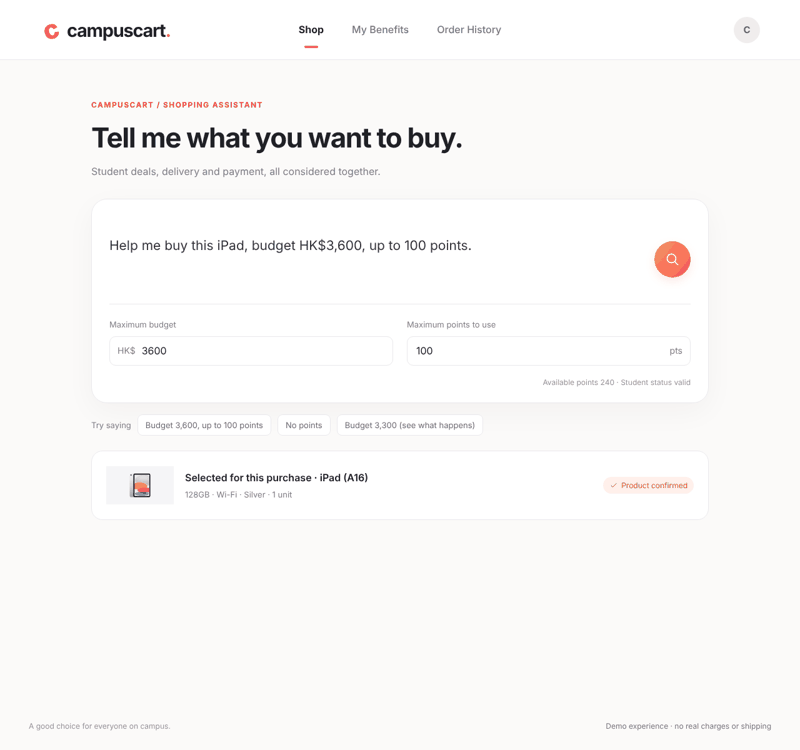
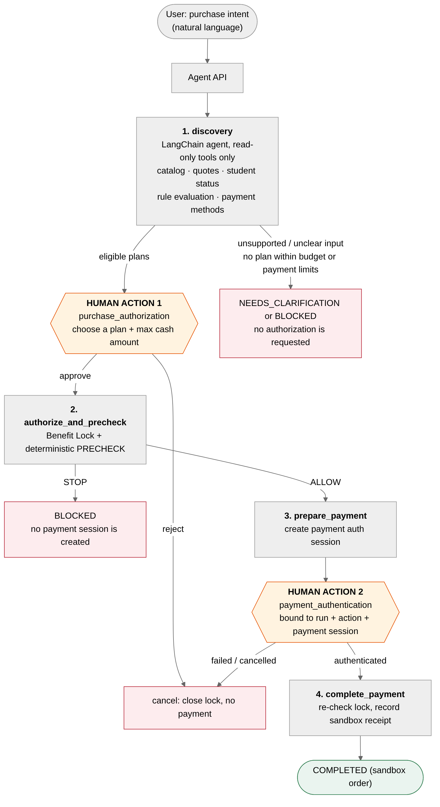
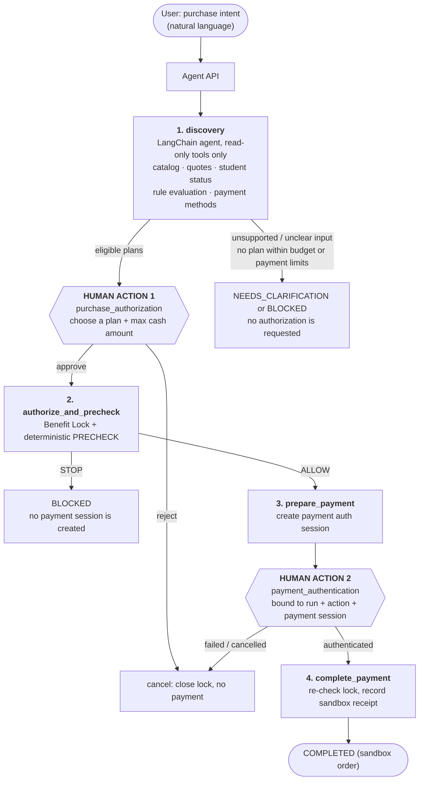
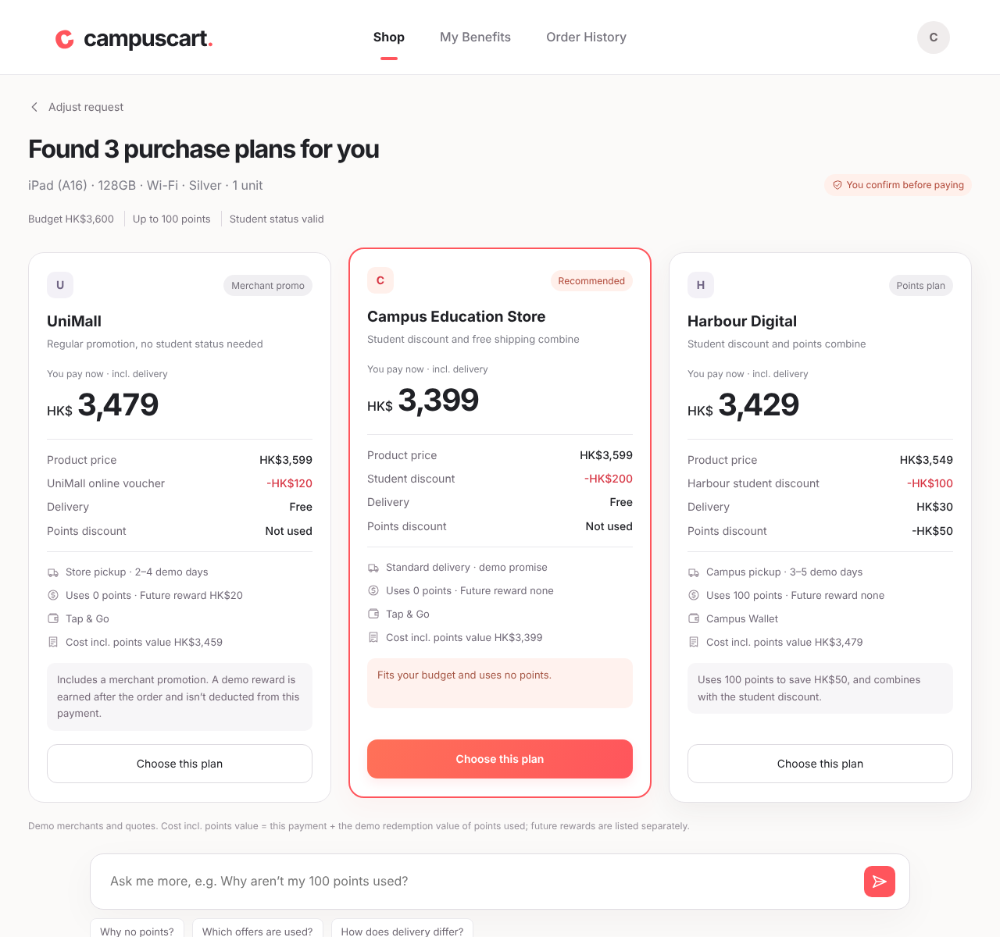
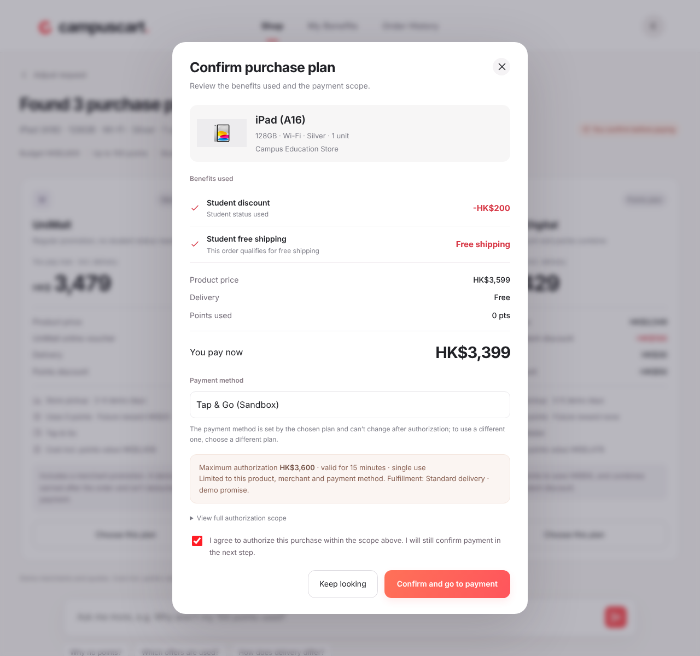
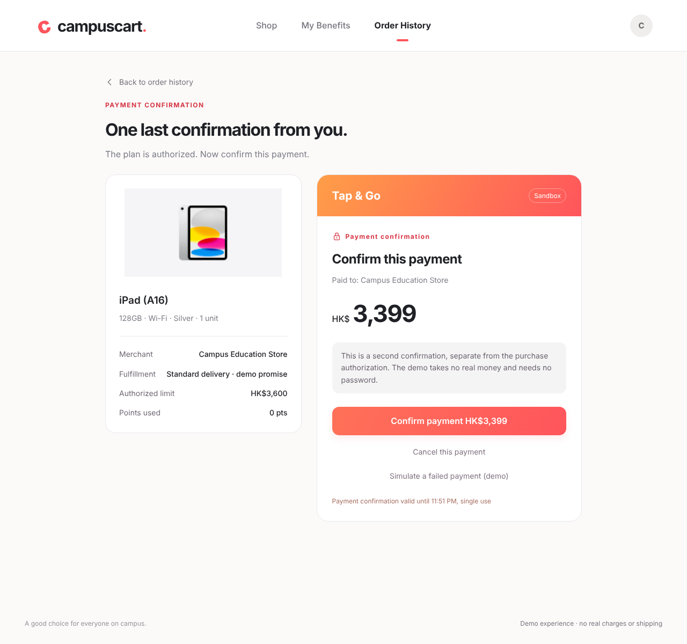
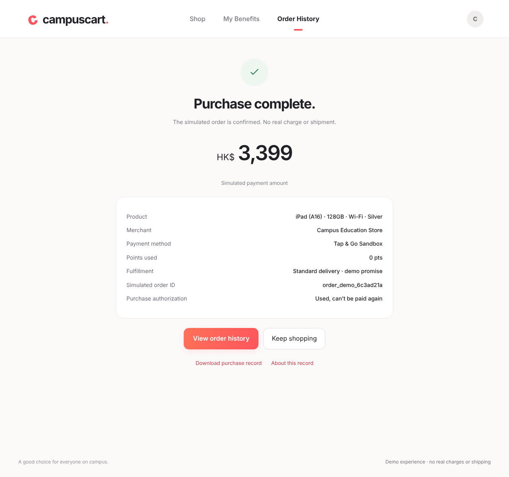
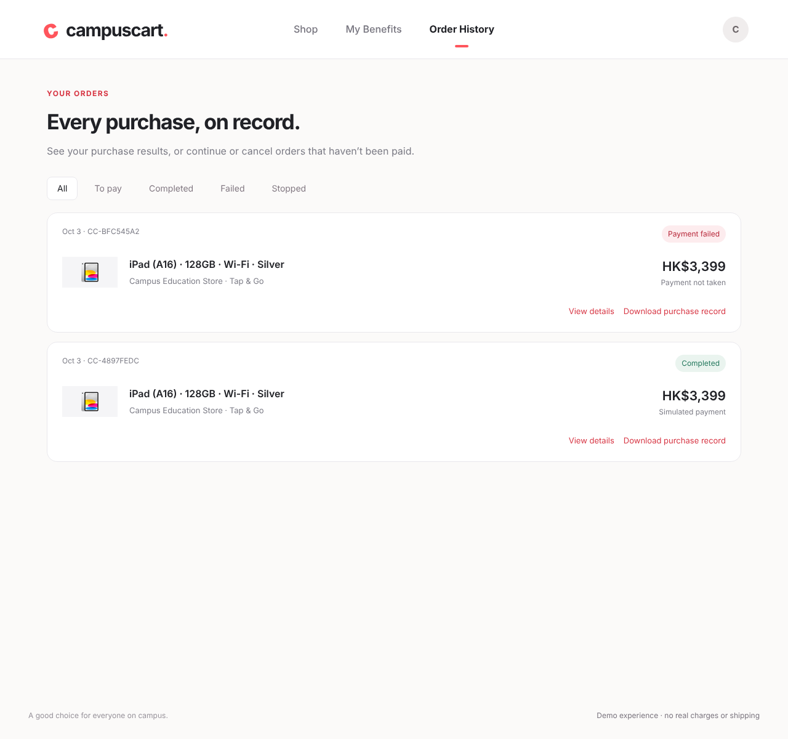
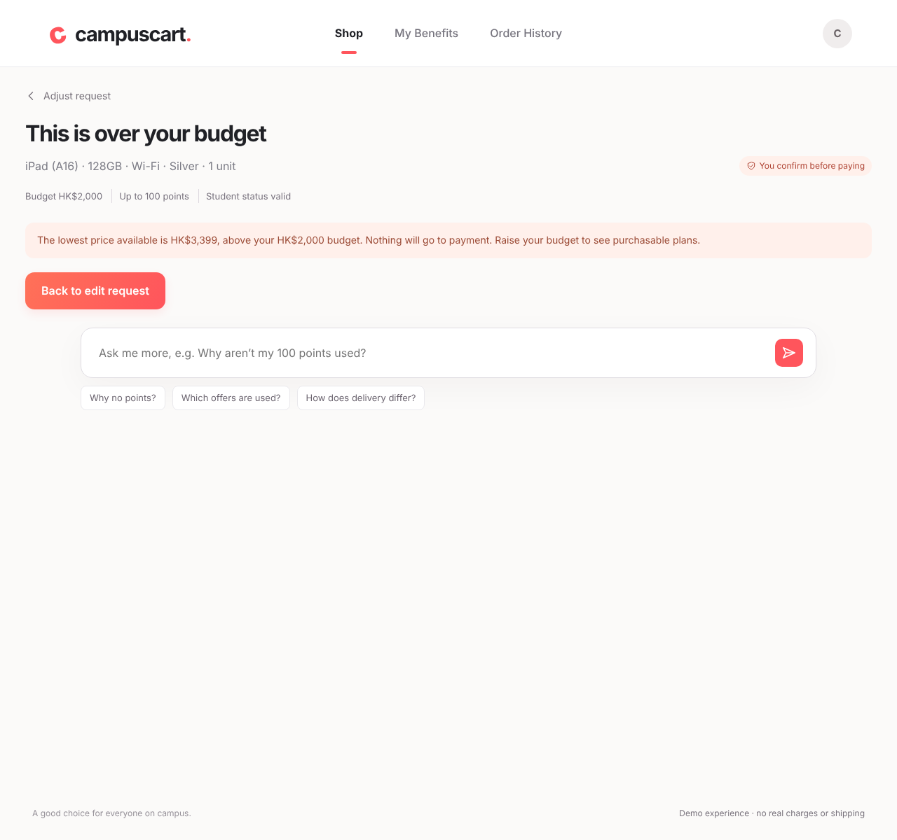
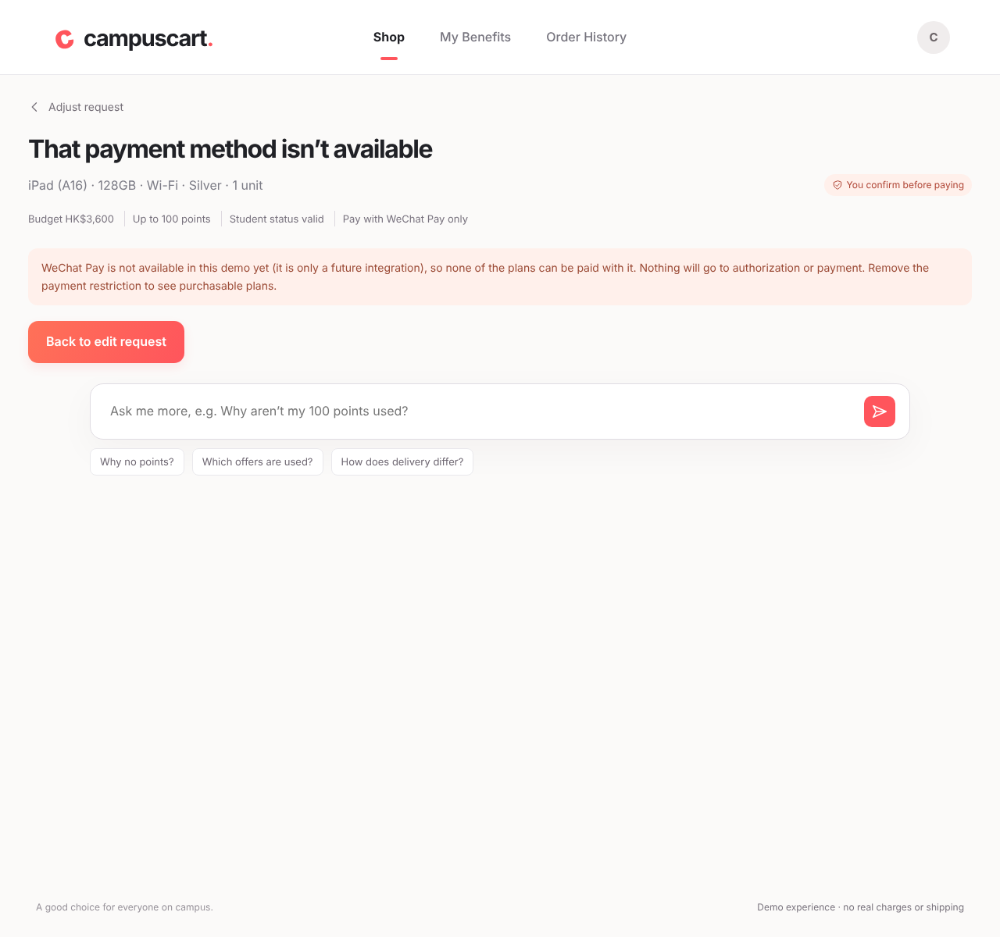

# CampusCart

> **Demo video:** [Watch CampusCart on YouTube](https://youtu.be/Zsuv6p5m_U4)

> CampusCart is a policy-controlled shopping agent that turns purchase intent into an auditable, user-authorized checkout.



All merchants, student status, offers, orders and payments in this repository are **synthetic sandbox data**. No real money moves and nothing is shipped.

## Contents

1. [The problem](#1-the-problem)
2. [Core features](#2-core-features)
3. [Architecture](#3-architecture)
4. [Demo walkthrough](#4-demo-walkthrough)
5. [Run it locally](#5-run-it-locally)
6. [Environment variables](#6-environment-variables)
7. [Tech stack](#7-tech-stack)
8. [Security design](#8-security-design)
9. [Current limitations and next steps](#9-current-limitations-and-next-steps)
10. [Repository map](#10-repository-map)

## 1. The problem

Students juggle student discounts, merchant coupons, loyalty points and payment-method rules. Comparing them by hand is slow, and the offers that look cheapest often fall apart at checkout (a shipping fee appears, a coupon has expired, the points cap is exceeded).

An AI shopping agent could do the comparison, but handing an LLM a payment method is dangerous: it can misread a budget, be steered by a prompt injection, or spend money the user never approved.

CampusCart separates the two jobs. The agent understands the request and explains the options, while **deterministic code, plus two explicit human approvals, decides whether any money moves**.

## 2. Core features

- **Natural-language purchase intent.** For example `Help me buy this iPad, budget HK$3,600, up to 100 points.`
- **Multi-merchant comparison.** Three merchants are compared on price, student discount, delivery fee, points redemption and payment method, with the cheapest eligible plan recommended.
- **Deterministic rule engine.** Budget, offer stacking, points limits, offer validity and payment-method rules are computed in integer cents by code, not by a model.
- **Two human authorizations.** The user first authorizes one plan up to a maximum cash amount, then separately confirms the payment.
- **Benefit Lock and PRECHECK.** Approval creates a single-use, time-limited lock bound to the SKU, merchant, offers and payment method. A final price and rule check runs before any payment session exists.
- **Safe STOP paths.** Over budget, unavailable payment method, unsupported quantity or variant, user rejection and payment failure all end without payment.
- **Auditable by design.** Every run produces two SHA-256 hash chains (agent trace and transaction audit) that can be downloaded as a purchase record.
- **Grounded Q&A.** Follow-up questions such as "Why aren't my points used?" are answered from the actual plan data.
- **Works without an API key.** A tested deterministic LangGraph fallback runs the same workflow when no LLM is configured.

## 3. Architecture



<details>
<summary>Mermaid source (renders on GitHub)</summary>



</details>

| Layer | Responsibility | Can it move money? |
| --- | --- | --- |
| Front end (`public/`) | Search, plan cards, authorization dialog, payment page, order history | No, it only calls the Agent API |
| Agent API (`src/agent/api.js`) | HTTP contract in [`docs/openapi.yaml`](docs/openapi.yaml): create run, resume, messages, trace, SSE | No |
| LangGraph workflow (`src/agent/runtime.js`) | Tool ordering, pauses at the two human actions (`interrupt`), resume | Only through the transaction core, after approval |
| LangChain agent (`src/agent/coordinator.js`, `tools.js`) | Understands intent, calls **read-only** tools, writes explanations | **No.** It has no authorize, lock or pay tool |
| Transaction core (`src/domain/`) | Rule engine, Benefit Lock, PRECHECK, ALLOW / STOP, audit chains | Yes, and it is the only authority |
| Adapters (`src/agent/adapters/`) | Mock merchant, identity and payment providers | Sandbox only |

For the state machines, tool permissions and TOCTOU notes see [`ARCHITECTURE.md`](ARCHITECTURE.md) (written in Chinese). The front-end integration notes are in [`FRONTEND-INTEGRATION.md`](FRONTEND-INTEGRATION.md).

## 4. Demo walkthrough

Start the app (see [Run it locally](#5-run-it-locally)) and open it in a browser.

**Happy path**

1. On the home page click **Budget 3,600, up to 100 points**, then press the search button.
2. The agent compares three merchants. **Campus Education Store at HK$3,399** is recommended.
3. Click **Choose this plan**, review the benefits and the maximum authorization, tick the consent box and press **Confirm and go to payment**. This is human action 1.
4. On the payment page press **Confirm payment**. This is human action 2.
5. The result page shows the simulated order. **Order History** has the record, and **Download purchase record** exports the run, trace and audit chains as JSON.

**Bad cases (the agent must stop safely)**

| Try this | What happens |
| --- | --- |
| Set **Maximum budget** to `2000` and search | "This is over your budget." The lowest price is shown, plan cards are hidden, nothing goes to authorization. |
| Type `Help me buy this iPad, budget HK$3,600, I can only use WeChat Pay.` | `NO_EXECUTABLE_PLAN`. WeChat Pay is only a `future_integration` placeholder, so no plan can use it and nothing reaches authorization or payment. |
| Type `I want two iPads, budget HK$7,000, up to 100 points.` | `AMBIGUOUS_QUANTITY`. The demo only buys 1 unit, so the agent asks to confirm instead of silently pricing one. |
| On the payment page press **Simulate a failed payment (demo)** | "Payment failed." The lock is closed, no money is taken, and Order History shows a red **Payment failed** record. |
| On the payment page press **Cancel this payment** | The authorization is closed and the order shows as **Cancelled**. |

<details>
<summary>Screenshots</summary>

| | |
| --- | --- |
|  |  |
|  |  |
|  |  |
|  |  |

</details>

## 5. Run it locally

Requirements: **Node.js 22** (see `.nvmrc`; the app declares `>=22 <23`) and npm.

```bash
git clone <your-repository-url>
cd <repository-folder>
npm install
npm start
```

Open <http://127.0.0.1:3000>. If port 3000 is busy, use another one:

```bash
PORT=3100 npm start
```

With no configuration the agent runs in `langgraph_deterministic_fallback` mode. To use a real LLM, copy `.env.example` to `.env`, add your own key and restart (see [Environment variables](#6-environment-variables)).

Agent runs, LangGraph checkpoints, transactions, payment sessions, knowledge documents, reflection memories and after-sales cases persist in `data/campuscart.sqlite` by default. Pending confirmations can resume after a server restart.

```bash
npm test             # rules, transaction state machine, agent graph, HTTP contract, STOP-before-payment
npm run demo         # deterministic success and blocked scenarios in the terminal
npm run demo:agent   # natural language, tool trace, authorization, outcome
npm run demo:audits  # regenerate the sample audit files in docs/demo-audits/
npm run knowledge:ingest -- path/to/documents.json  # add source-attributed RAG documents
npm run smoke:llm    # needs OPENAI_API_KEY; makes one real model call and stops before authorization
```

To check which mode is active, open <http://127.0.0.1:3000/api/v1/agent/capabilities> (`modelConfigured` shows whether a key was found). The front end's "About" dialog (the round **C** button) reports it as well.

## 6. Environment variables

Copy [`.env.example`](.env.example) to `.env`. The real `.env` is git-ignored: **never commit an API key**.

| Variable | Required | Default | Purpose |
| --- | --- | --- | --- |
| `OPENAI_API_KEY` | No | empty | Enables LLM tool calling (`langchain_llm_tools`). Empty means deterministic fallback. |
| `OPENAI_BASE_URL` | No | `api.openai.com` | Base URL of any OpenAI-compatible provider (for example `https://api.deepseek.com`). |
| `CAMPUSCART_AGENT_MODEL` | No | see `.env.example` | Model name sent to the provider (for example `deepseek-chat`). |
| `CAMPUSCART_EMBEDDING_MODEL` | No | empty | Enables persistent hybrid vector + FTS5 retrieval when the provider supports embeddings. |
| `CAMPUSCART_EMBEDDING_API_KEY` | No | `OPENAI_API_KEY` | Optional separate key for the embedding provider. |
| `CAMPUSCART_EMBEDDING_BASE_URL` | No | `OPENAI_BASE_URL` | Optional separate OpenAI-compatible embedding endpoint. |
| `CAMPUSCART_EMBEDDING_DIMENSIONS` | No | provider default | Optional positive integer dimension for compatible embedding models. |
| `PORT` | No | `3000` | HTTP port. |
| `HOST` | No | `127.0.0.1` | Bind address. |
| `CAMPUSCART_DB_PATH` | No | `data/campuscart.sqlite` | SQLite database for Agent state, RAG knowledge, reflection memory and after-sales cases. |
| `CAMPUSCART_OPERATOR_API_KEY` | For operator API | empty (API disabled) | Bearer key for the isolated manual after-sales API. Use a long random secret. |
| `CAMPUSCART_OPERATOR_ID` | No | `sandbox-operator` | Stable reviewer identity written into the operator audit trail. |
| `CORS_ORIGIN` | No | unset | Allow one other origin to call the API, for a separately served front end. |

If the model call fails (wrong key, region block, timeout) the run records a `model_invocation_failed` trace event and falls back to the deterministic workflow, with `agentMode: langgraph_fallback_after_model_error`. It never lets the model pay.

## 7. Tech stack

- **Runtime:** Node.js 22, ES modules, the built-in `node:http` server and `node:test`
- **Agent:** LangChain (`createAgent`, tool calling) and LangGraph (`StateGraph`, `interrupt`, persistent `SqliteSaver`)
- **Persistence and retrieval:** SQLite, FTS5 + lexical retrieval with optional persistent OpenAI-compatible vectors, persistent checkpoints and quality-gated reflection episodes
- **LLM access:** `@langchain/openai` (`ChatOpenAI`), compatible with OpenAI-style endpoints such as DeepSeek
- **Validation:** Zod schemas for the API and tool contracts
- **Domain:** a hand-written deterministic rule engine, transaction state machine and SHA-256 hash-chained audit log, with no framework
- **Front end:** dependency-free HTML, CSS and vanilla JavaScript in `public/`, served by the same Node process
- **API contract:** OpenAPI 3.1 in [`docs/openapi.yaml`](docs/openapi.yaml)
- **CI:** GitHub Actions runs `npm ci` and `npm test` on Node 22

## 8. Security design

**Users approve twice.** Nothing is bought on the strength of a chat message.

1. `purchase_authorization`: the user picks one plan. The approval binds the SKU, merchant, offer versions, payment method, points and a **maximum cash amount**.
2. `payment_authentication`: after the checks pass, the user confirms the payment separately. This step is bound to `runId + actionId + paymentSessionId`, is single use, and expires.

**The LLM cannot pay.** The model only gets read-only and evaluation tools (catalog, quotes, student status, rule evaluation, payment-method listing, decision inspection and cited knowledge retrieval). Tools that authorize, create a lock, confirm a payment or issue a refund are **not exposed to it**. Only a controlled workflow calls them after a human action. A prompt injection, retrieved document or bad model answer cannot reach the money path, and a failed or missing model response falls back to the deterministic graph.

**Deterministic code decides ALLOW / STOP.** Budgets and prices are integer cents. The rule engine and the Benefit Lock decide, and these checks run twice, before the payment session is created and again at completion:

- the plan must be within budget, and a plan over budget is ineligible at recommendation time
- the lock must be active, unexpired, unused, and match SKU, merchant, payment method and offer versions
- any price increase needs reconfirmation, and a total above the authorized cap is a STOP
- points obey the switch, the cap, the balance and the redemption step
- a hard payment constraint with no executable path is a STOP, and soft preferences never pose as authorization
- a STOP never creates a payment session, and a finished action cannot be replayed

**Orders and payments are Sandbox / Mock.** Tap & Go and Campus Wallet are local mocks. Credit card, WeChat Pay, AlipayHK/Alipay and Octopus are `future_integration` contracts that fail explicitly if executed. The payment page in this demo simulates the provider callback in the browser; a real integration must redirect to the provider and resume the graph from a signature-verified webhook, never from a browser claim.

**Auditability.** The agent trace, transaction audit and after-sales case audit use forward hash chains (`hash[n] = SHA256(hash[n-1] + event[n])`). They detect changes to a saved copy but are **not** third-party notarization.

**RAG and reflection are advisory.** Knowledge retrieval returns source identifiers. It uses local FTS5 by default and adds persistent vector ranking only when a separate embedding model is explicitly configured. Reflection episodes have a verified/rejected quality gate, usage counters and feedback records; they may improve clarification, tool routing and explanations, but are explicitly prohibited from changing prices, budgets, eligibility, authorization scope or payment execution.

**After-sales is separately authorized.** Natural-language requests can enter through `POST /api/v1/after-sales/requests`. `cancel_order` and `refund` create a one-time user confirmation before the sandbox refund changes the order. `return` and `exchange` enter `MANUAL_REVIEW`. They can advance only through the isolated `/api/v1/operator/*` routes, protected by `CAMPUSCART_OPERATOR_API_KEY`; the key and operator tools are never exposed to the shopping Agent. Operator mutations require idempotency keys, enforce state preconditions, and record reviewer identity in the service-case audit. Returns refund only after receipt; exchanges create a sandbox replacement record without refunding the original payment. Payment refunds and merchant return/exchange operations now run through injectable async adapters. Their source-attributed receipts are validated, persisted and included in both case and transaction evidence; provider failure leaves the paid transaction unchanged and routes the case to manual review. The bundled adapters remain deterministic sandboxes. See `GET /api/v1/after-sales/capabilities` and the OpenAPI contract.

**Other hygiene.** The legacy transaction API is retired (HTTP 410) so there is no side door around human authorization. Request bodies are size-limited and malformed JSON returns 400. The front end HTML-escapes backend-supplied strings. `.env` is git-ignored and no key is stored in the repository.

## 9. Current limitations and next steps

**Limitations (stated plainly)**

- **Controlled SKU.** The current demo uses a controlled SKU (one iPad, 128GB Wi-Fi, silver, quantity 1) to validate the transaction architecture. Production deployment will connect the same workflow to a dynamic catalog adapter. Until then, requests for other quantities, storage sizes, models or colours stop for clarification instead of being substituted.
- **Mock providers.** Merchants, identity, offers, payments, refunds and merchant after-sales operations are synthetic. Prices, offers and student rules are not live data and imply no partnership.
- **Local persistence only.** SQLite makes local runs recoverable, but production still needs managed database availability, access control, backups, encryption and retention jobs.
- **Small-corpus vector search.** Embeddings are persisted in SQLite and cosine ranking runs in-process. This is suitable for the demo knowledge set; a large production corpus should use pgvector, Qdrant or another managed vector index with tenant filters.
- **Fallback intent parsing.** Without an LLM, budget, points, quantity and payment preferences are read by a small set of text rules. With an LLM, tools and explanations are model-assisted, but all decisions remain deterministic.
- **LLM mode coverage.** `langchain_llm_tools` was exercised against an OpenAI-compatible endpoint (DeepSeek). The test suite also uses a local protocol stub, which is an integration regression and not a real model call.
- **No delivery-deadline support**, and the Benefits page is read-only demo data.

**Next steps**

- Add a dynamic catalog and merchant adapter with trusted quote ingestion (adapter identity, signed or versioned quotes, expiry, normalized offers)
- Move the local SQLite persistence layer to a managed transactional database and add authentication/tenant isolation
- Real payment provider integration with redirect or SDK token, verified webhooks, idempotency, pre-authorization and capture, and reconciliation
- Authentication and consent for real student verification, plus data-retention policy
- Replace the shared sandbox operator key with per-user OIDC/RBAC, key rotation and a production review console
- Quantity and multi-item support once per-unit offer rules are defined (for example whether the student discount applies per unit)
- Observability, external timestamping for the audit chains, and a legal and privacy review before any real launch

## 10. Repository map

```text
public/            front end (api.js is the only file that calls the backend)
src/server.js      HTTP server and static files
src/agent/         API handlers, LangGraph runtime, LangChain coordinator and tools, mock adapters
src/after-sales/   post-purchase service-case state machine and API
src/operator/      isolated operator authentication and manual-review API
src/knowledge/     seeded source-attributed knowledge for local RAG
src/domain/        rule engine, transaction state machine, audit hash chain, seed data
src/persistence/   SQLite schema, repositories and LangGraph checkpoint wiring
tests/             node:test suites
scripts/           terminal demos, audit export, live LLM smoke test
docs/              OpenAPI contract, workflow diagram, screenshots, sample audits
```

Background material in Chinese: [`Shopping_Agent_PRD.md`](Shopping_Agent_PRD.md), [`Shopping_Agent_Research_Notes.md`](Shopping_Agent_Research_Notes.md), [`ARCHITECTURE.md`](ARCHITECTURE.md).

## License

[MIT](LICENSE)
