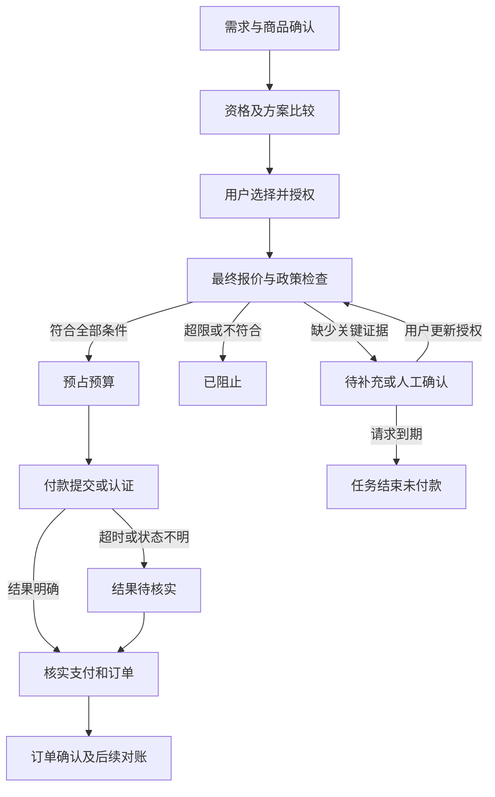

# CampusCart：香港高校学生购物 Agent — 产品需求文档

> 版本：v0.2｜研究与产品方案稿＋实现状态同步｜2026-10-03｜工作名称，可在品牌评审时更改。

> **实现状态说明（2026-10-03）：** 当前仓库完成的是固定 iPad Demo SKU 的纵向 Hackathon 沙盒闭环，包括自然语言 Agent、确定性比较、两次人工动作、Benefit Lock、成功与 STOP 审计。本文其余多品类、退款对账、支付未知结果、真实履约和生产集成仍是产品设计或 Future Work，不能表述为已实现。权威运行范围见 `README.md`。
>
> **产品覆盖广泛消费品类；MVP 验证一条完整交易链路，并展示跨品类规则复用。** 本文沿用原模板的 14 个核心板块。第 5 节定义 MVP，第 13 节给出可演示的完整链路与验收条件。
>
> 证据标记：**事实**＝公开来源支持；**推导**＝基于事实计算；**产品决策**＝本 PRD 建议采用；**假设**＝需要用户研究验证；**依赖**＝需要外部确认。正文引用对应文末链接及《Shopping_Agent_Research_Notes.md》。本次未进行用户访谈、真实购买、支付接口联调或奖励到账验证，不把方案中的预期行为写成已实现结果。

## 1. 文档基本信息

| 项目 | 本版内容 |
| --- | --- |
| 产品名称 | CampusCart，香港高校学生购物 Agent |
| 产品阶段 | 比赛 MVP 的需求与可行性评审；同时定义后续多品类产品 |
| 文档负责人 | 产品负责人角色；团队在立项时指定具体成员 |
| 协作角色 | 产品／研究、交互设计、规则与后端、前端与集成、测试与数据运营；小团队可兼任 |
| 研究日期 | 2026-10-02，Asia/Hong_Kong；逐项观察时间见研究附录 |
| 研究范围 | 38 项官方或服务商资料，涵盖学生统计、教育优惠、日用零售、会员、支付、订阅、竞品及技术约束 |
| 交付物 | 本 PRD、研究与证据附录、计算与规则复核结果 |
| 原型／代码状态 | 已完成固定单 SKU 的可运行 Hackathon 沙盒原型；未接入生产支付、真实商户、真实身份或真实履约 |
| 排期口径 | 采用立项日 T0 起的相对排期，避免虚构团队已承诺的比赛日期 |
| 版本记录 | v0.1：多品类产品方案；v0.2：同步单 SKU Hackathon 实现边界并修复附录文件引用 |

## 2. 产品概述与问题定义

### 2.1 一句话定位

为香港高校学生提供一个按消费意图工作的购物 Agent：在用户实际可用的学生资格、会员权益和支付工具范围内，寻找符合需求的商品，比较可以同时成立的优惠组合，并在明确授权和可执行的付款上限内完成购买。

用户获得的是三项直接价值：**少查规则、少付不必要的费用、购买过程可控**。结果页必须回答：这件商品符合我的要求吗；现在实际要付多少；奖励何时、怎样获得；为什么选它；代理到底有权做什么。

### 2.2 具体问题

学生在选购和付款时需要跨越学校／商户教育商店、会员平台及银行或钱包页面。规则不只分散，还存在身份、商品、渠道、时间、优惠叠加及支付路径之间的依赖。仅罗列优惠或比较广告返现率，无法判断某个用户对某一购物篮的可实现成本。

本产品要解决的决策单元是：**对用户当前确认的购买任务，选择满足商品、履约及授权约束的“商户＋购物篮＋优惠组合＋履约方式＋支付路径”。** 不能把原本只想买一件商品的用户引导成更多消费，再把新增消费获得的折扣称为节省。

### 2.3 市场事实及解释边界

以下历史统计来自 2024/25 专上教育表；该表通过官方来源的搜索索引读取，原 PDF 直取超时。2026 年统计栏目已更新，但本次未成功核验其最新整表，故**不将这些数字称为最新在校人数**。[S01]

| 指标 | 2023/24 | 2024/25 | 对产品的意义 |
| --- | ---: | ---: | --- |
| 本科在读 | 132,000 | 138,500 | 需覆盖持续多年的在读与资格更新 |
| 修课研究生在读 | 62,400 | 73,000 | 不能只研究本科，且不能只使用 UGC 资助课程口径 |
| 研究研究生在读 | 17,500 | 19,500 | 包含研究硕士与博士，不能整体当作博士人数 |
| 非本地学生，含副学位 | 73,700 | 92,000 | 反映非本地学生规模，不等于内地学生人数 |
| 非本地修课研究生 | 38,100 | 49,100 | 支持优先验证赴港研究生使用场景，不能直接证明其优惠痛点 |

**推导：**2024/25 本科、修课研究生与研究研究生合计约 231,000；扣除副学位后，非本地对应群体约 89,000。非本地学生含副学位同比约增长 24.8%。这些是教育人口口径，不是可付费用户数、消费频次或 TAM 收入预测。[S01]

另一份教育局资料给出：2025/26 UGC 资助课程非本地学生约 30,400，为暂定数。UGC 的 2024/25 宣传册还区分了资助课程与包含自资课程的大学总口径；它们与上表不可相加。[S02][S03] 招生上限政策同样不等于实际招收人数。[S38]

### 2.4 真实规则暴露的问题

| 观察事实 | 容易产生的错误 | 本产品的设计响应 |
| --- | --- | --- |
| HKT education 需要机构资格、学校邮箱和购买时的证明 [S07] | 自报“学生”便自动套用教育价 | 优惠资格按商户验证，保存验证范围与时效 |
| adidas 优惠券可能互斥，券后低于免运门槛还会增加运费 [S22] | 永远选择面额最大的券 | 计算完整订单金额，并保留不用券的候选方案 |
| Apple 香港付款页提示收单银行在英国，银行可能另外收费 [S09] | 看见 .hk 或 HKD 就认定无境外交易费 | 商户域名、结算币种和收单地区分别建模 |
| MMPOWER 对合资格全日制学生有门槛例外 [S15] | 对所有学生和非学生使用同一门槛 | 资格以银行记录／可核验证明为准；学校身份不直接替代银行资格 |
| MoneyBack 和 yuu 的计分、兑换与有效期不同 [S16][S18] | 把一积分固定看成一港元 | 按计划、兑换用途、步长、余额与到期批次计值 |
| 旧 adidas 推广条款仍能被检索 [S23] | 检索到的页面都当作当前优惠 | 活动有效期与采集时间双重校验 |

以上证明“规则存在复杂性”，尚未证明“多少学生因此损失多少钱”。后者由第 13 节的访谈与对照任务验证。

### 2.5 现有方案与差异化

| 方案 | 本次观察到的能力 | 本产品应补充的能力 |
| --- | --- | --- |
| UNiDAYS／Student Beans | 学生验证、优惠发现和兑换入口 [S30][S31] | 把用户当前购物篮、配送和本人已有支付工具一起计算 |
| MoneyHero | 信用卡比较、申请及迎新优惠展示 [S32] | 服务当前购买，不以用户新开卡或借款作为默认前置条件 |
| MoneyBack／yuu | 会员积赚、兑换及参与商户生态 [S16][S18] | 跨计划比较，但保留各自价值与适用范围 |
| 商户教育商店／银行与钱包 App | 自己体系内的资格、报价、优惠和付款 | 跨体系整理，并将最终行动绑定用户授权 |

此表是公开页面功能观察，并未对竞品完成全功能实测；不据此声称竞品完全没有相关能力。待验证的差异化是：**购物任务中的规则可执行、成本可解释、付款边界可验证**。

## 3. 目标用户与消费场景

### 3.1 用户范围及优先顺序

正式产品面向香港高校本科生、授课型及研究型硕士生、博士生，兼顾本地与非本地学生。首批研究优先覆盖赴港不久、愿意比较优惠的学生；“更不熟悉本地规则”作为访谈假设，不以籍贯推定消费能力或金融知识。

MVP 自主购买仅开放给年满 18 岁、为本人消费并使用本人获准使用的支付工具的用户。未满 18 岁可以浏览公开信息，监护人委托链留待后续版本；这是产品范围决策。[S08]

| 行为分组，非人口标签 | 典型需要 | 产品安排 |
| --- | --- | --- |
| 刚到港，尚无本地信用卡 | 找到自己真正能用的折扣 | 先比较商品及学生价；付款筛选只展示本人已有工具 |
| 已有钱包、会员及少量信用卡 | 在结账时快速选择组合 | 使用权益档案；只在影响当前排名时询问额度或登记信息 |
| 经常比较优惠的在读学生 | 看到推导过程和来源 | 展开完整算式、排除原因和更新时间 |
| 年龄／修读模式不符合某优惠的研究生 | 避免被错误标记为“学生都可用” | 资格逐项判断，仍保留普通促销或无优惠方案 |

### 3.2 两种入口对应两种用户意图

**入口 A：我想买。** 用户描述需求或输入商品。系统先确认用途、必要规格、数量、总预算、最晚需要日期及是否接受自提，再推荐有限候选。模型不得先为了优惠换掉用户要求的型号、尺码或数量。

**入口 B：我准备付款。** 用户导入商品链接、购物篮或账单截图。默认锁定当前商户和商品，只优化已有篮子的优惠、配送及支付方式。其他商户的价格放在“可选比较”中，不打断当前结账；只有用户主动选择后才变更任务。

截图识别结果必须先让用户确认商品、金额及数量；截屏或链接均不是可靠的最终报价，也不是付款授权。

### 3.3 多品类支持与差异

| 品类 | 必要属性 | 特有判断 | 产品路线 |
| --- | --- | --- | --- |
| 数码与学习设备 | 精确型号、容量、连接方式、保修、新旧状态 | 教育资格、配额、到货期、不可取消条件 | MVP 完整沙盒交易主场景 |
| 日用、食品及超市 | 品牌、条码、净含量、包装数、替代许可 | 满减与配送、单价、重量、缺货替代 | MVP 比较与规则验证；逐步接入履约 |
| 美妆与个人护理 | 规格、色号、数量及用户指定限制 | 会员积分、App 限定券、取货门槛 | MVP 比较与规则验证 |
| 服饰与运动 | 款号、尺码、颜色、退换偏好 | 券互斥、尺码库存、券后免运 | MVP 券规则证据；后续实时结账接入 |
| 餐饮与文娱 | 日期、人数、门店、时段、票种 | 服务费、预约、退款及实名要求 | 后续独立品类适配；初期展示来源入口 |
| 学生订阅服务 | 地区、账户、续费周期和资格期限 | 自动续费、优惠失效后转价 | 后续专门的持续授权；MVP 不代开订阅 |

广泛品类意味着共用任务、规则、授权及支付模型，不意味着首版已覆盖所有商户和商品。交通学生权益作为后续发现服务，不能把零售付款代理直接用于闸机乘车。[S29]

### 3.4 核心用户故事

- 作为初到港学生，我想先知道手上已有工具能用哪些优惠，再决定是否值得做额外认证。
- 作为准备付款的学生，我希望系统比较当前篮子，说明实际扣款与之后奖励，而不用重新开始整个购物流程。
- 作为预算有限的用户，我可以授权代理在上限内购买；若费用上升或条件改变，它应停止并清楚告诉我原因。
- 作为拥有积分的用户，我希望知道为了少付现金消耗了多少已有权益，避免把自己的积分误当成商户赠送的节省。

## 4. 产品目标与成功指标

### 4.1 目标

1. 用户能在一次购买任务中得到可验证的方案，而非无法兑现的最高优惠。
2. 同时展示本次资金支出和预计权益成本，允许用户明确选择优化目标。
3. 在可证明限制生效的执行环境中完成交易；无法取得关键条件时停止自动付款。
4. 用一次完整交易及多类规则案例证明系统可以扩展到不同商品类别。

### 4.2 指标与验收目标

下列数值是**产品目标**，不是已取得的结果；所有用户基线尚未实测。

| 指标 | 口径 | MVP 目标／测量方式 |
| --- | --- | --- |
| 有效方案输出率 | 输入受支持且完整的任务中，输出至少一条资格和成本可说明的方案占比 | 至少 90%；未覆盖商品另计，不从失败分母中隐藏 |
| 优惠判断准确率 | 人工双人核验的资格、互斥、金额、有效期判断正确项／总项 | 至少 98%；关键金额或越权错误为发布阻断项 |
| 已核验集合内的排序正确率 | 与穷举规则基准的第一名一致；并列均算正确 | 固定验收集 100%，不宣称全市场最优 |
| 交互效率 | 从输入确认至能作付款决定；含用户补充信息，支付认证单列 | 对照实验中位耗时下降至少 30%，否则复核价值假设 |
| 计算响应 | 资料齐备、无需外部认证时从请求到可解释比较 | P95 不超过 10 秒；超过时给进度及已完成部分 |
| 约束执行 | 超额、过期、撤销生效后的新付款及重复扣款 | 预设验收场景均为 0 次；必须同时测可合规成功 |
| 误拦截 | 已确定符合所有条件且执行环境可用，却被错误拒绝 | 固定验收集为 0；真实试点单独记录 |
| 实际节省 | 相同需求和资格下人工方案最终成本减 Agent 最终成本 | 不预设虚构金额；允许 0 或负数，记录原因 |
| 证据完整性 | 使用中的价格、费率、奖励规则具有来源、时间与版本 | 100%；不满足的数值不进入自动交易 |

## 5. MVP 范围与优先级

### 5.1 必须交付的 MVP 链路

**成年学生提出固定购买任务 → 确认商品和履约约束 → 提供必要资格与已有支付工具 → 读取有来源的报价和规则 → 比较方案 → 确认一笔限时限额授权 → 独立执行层检查最终报价 → 沙盒付款与订单确认 → 展示账本及决策证据。**

同一条链路必须再运行一次超预算情形，并展示付款调用被拦截；成功与停止必须来自实际运行日志，不能只播放预先编写的文本。当前 Hackathon MVP 已用固定单 SKU 沙盒实现该纵向演示，并由自动化测试验证 STOP 分支的支付调用数为零；这不代表多品类或生产支付已完成。

### 5.2 MVP 的宽度与深度

| 交付层 | 本期承诺 | 明确不代表 |
| --- | --- | --- |
| 产品入口 | 支持“选购”和“付款前优化”两种任务 | 不承诺任意自然语言需求都能自动找到商品 |
| 品类宽度 | 数码、日用食品、个人护理三个类别具备任务及规则案例；服饰可演示券失效与互斥判断 | 不以只有数码页面的界面冒充多品类产品 |
| 数据深度 | 白名单来源及人工核验规则版本，展示实时／历史快照／用户输入标记 | 不展示虚构全网覆盖率 |
| 交易深度 | 一种精确 SKU、一家受控演示商户、一种沙盒支付适配器贯通 | 不表示已向 Apple、HKT education 或其他真实商户下单 |
| 支付比较 | Tap & Go及用户已有工具的适用性与费用条件；复杂信用卡奖励先作为条件估算 | 不以未经核实的返现承诺自动付款 |
| 约束 | 精确商品、一笔订单、金额上限、期限、撤销、幂等、最终报价变化检查 | 不依赖提示词让模型自行克制 |

### 5.3 功能优先级

| 功能 | 级别 | 本期定义 |
| --- | --- | --- |
| 任务解析与缺失条件澄清 | P0 | 结构化确认商品、数量、商户锁定、预算、履约要求 |
| 最小权益档案 | P0 | 当前需要的学校资格、已有会员和支付工具；可跳过非必要信息 |
| 证据与规则库 | P0 | 手工核验的规则版本，保留原始来源及限制 |
| 资格、组合与成本计算 | P0 | 三态判断、优惠顺序、完整费用、积分口径及排序解释 |
| 授权及独立校验 | P0 | 一笔、限时、限额、可撤销的可执行政策 |
| 沙盒订单和付款闭环 | P0 | 明确标识、服务端执行、结果未知处理、防重复 |
| 停止页面及审计导出 | P0 | 触发规则、未提交证据、用户可读及机器可核验记录 |
| 多品类规则展示 | P0 | 至少三个类别，同一计算与授权框架运行 |
| 自动商户连接、真实支付 | P1，外部依赖 | 获取许可、凭证、测试资格与限额机制后接入 |
| 多商户拆单、自动替代 | P1 | 另行取得授权，并处理运费和多个订单的部分失败 |
| 持续补货、订阅、离线长期代理 | P2 | 单独的周期预算、续期与持续授权模型 |

### 5.4 真实上线前的硬性依赖

HKT education 条款包含自动化检索限制；公开页面适合引用作研究，不能由此假定获得长期抓取或代购许可。[S08] 本次未确认 Tap & Go 提供可用的第三方 Agent 限额代扣接口；搜索结果中的 `tap.company` 也不能当作 HKT Tap & Go。[S11]

生产交易必须先满足：商户接入许可、报价／订单接口、合规支付凭证托管、可验证金额边界、认证和撤销语义。缺失时提供比较与官方结账交接，标记“由你在商户完成付款”；这一降级体验不能计为 Agent 自动交易完成。

比赛是否接受沙盒作为端到端证据，由团队向主办方确认。若要求真实交易，真实接入与测试账户是比赛交付依赖，不能靠改名为“真实演示”解决。

## 6. 用户流程与系统状态

### 6.1 首次使用流程

1. **先给任务价值。** 不强制用户先上传学生证、绑定所有银行卡或建立完整资料。允许匿名输入需求并查看公开方案。
2. **确认购买对象。** 将自然语言或截图转成商品卡；不确定的容量、包装数量、尺码必须由用户确认。若只是探索，允许保存候选，暂不授权购买。
3. **补充会改变决策的条件。** 先问预算与履约，再问相关学生资格及已有支付工具；只有奖励上限影响排序时才问当月额度。
4. **给出有条件的比较。** 展示已核验方案及待验证方案。不能获得登录后价格时，明确提示缺少哪一项，而非伪造价格。
5. **确认选择与授权。** 显示预计总价、费用上限、到货／自提要求、取消条件、允许执行的动作和期限。可以只收藏或去商户自行结账。
6. **获取最终报价。** 再检查商品、所有费用、资格、库存、支付路径及授权状态。缺任一关键执行条件即暂停。
7. **执行并核实。** 处理支付认证、订单接受与扣款状态；结果未知时保持预算占用并查询，不自动更换支付方式重试。
8. **持续展示本单结果。** 区分订单确认、支付授权、实际扣款、预计奖励和已到账奖励。只有到账与费用核对后，才生成最终节省数字。

### 6.2 信息不足时的产品行为

| 缺失信息 | 默认行为 | 何时必须向用户补问 |
| --- | --- | --- |
| 学生证明 | 先给普通优惠与待验证教育方案 | 用户选择教育价或教育资格会影响最优方案时 |
| 支付工具 | 不推荐新开卡；先展示商户侧总价 | 需要比较本人可用支付路径或准备授权付款时 |
| 当月奖励剩余额度 | 给出奖励区间，不声称可享最高档 | 区间会改变推荐排序，且用户选择按奖励优化时 |
| 精确地址 | 先按用户选择的地区估计，并标明待确认 | 配送报价、范围或账单匹配需要时 |
| 最晚需要日期 | 提示货期并让用户选择“无硬性日期”或具体日期 | 执行前必须明确，不能把未知等同不在意 |
| 最终附加费用 | 可以比较已知部分，禁止自动付款 | 必须取得费用总额或可信的费用上界 |

### 6.3 状态机



支付状态与订单状态分开存储：`payment=authorized` 不等于 `captured`，`order=submitted` 不等于 `accepted`。Apple 的授权与出货后扣款安排就是需要区分这些状态的实际例子。[S09]

### 6.4 价格变化后的处理

默认授权允许价格降低，但不允许在已确认最终价基础上自动涨价，即使仍低于用户最初预算。用户可主动设置允许的涨价幅度；不能由 Agent 自行扩大。商品、商户、规格、交付期限、退改条件、积分消耗或支付工具改变时，按授权中分别规定的边界重新判断。

为减少打扰，系统只询问能够改变本次决策的缺失项，并合并一次展示。用户没有回答时保持停止；等待超时不构成同意。

## 7. 功能需求明细

全部 P0 需求必须有稳定编号、后端记录及对应验收用例。功能中的“官方已验证”只能由相应服务商回执或人工审核支持，自报信息要单独标记。

| 编号／功能 | 输入与触发 | 系统行为及输出 | 异常和验收条件 |
| --- | --- | --- | --- |
| FR-01 任务解析，P0 | 自然语言、商品链接或截图 | 输出类别、型号／规格、数量、预算、商户锁定、日期及履约选择；用户确认后冻结任务版本 | 无法确认 SKU 时禁止购买；数量、尺码或包装不能擅自改动 |
| FR-02 候选发现，P0 | 用户在“我想买”中确认需求 | 仅检索白名单覆盖范围；展示至多三个首屏候选及相同商品／可选替代标签 | 不能混用新旧产品、不同保修或不同容量；无结果时说明覆盖限制 |
| FR-03 权益档案，P0 | 相关优惠需要资格 | 保存商户作用域、验证状态、有效期、来源；支付工具只收品牌／卡种等必要描述 | 学校邮箱不能自动证明每项优惠资格；失效时降级为待验证 |
| FR-04 规则运营，P0 | 新来源或条款变动 | 采集草稿、结构化提取、人工校对、版本发布；保存生效时间与采集时间 | LLM 提取结果不能直接作为执行规则；冲突规则不得自动启用 |
| FR-05 资格及组合计算，P0 | 商品、用户和规则齐备 | 返回可用、不可用、待验证三态及原因；枚举合法券组合及不用券方案 | 正确处理互斥、最低消费、指定渠道、数量、库存和配送 |
| FR-06 成本与排序，P0 | 合法候选方案 | 分开展示即时支出、消耗权益、预计奖励、参考综合成本及不确定范围 | 未知费用不填零；已有积分不伪装成新增折扣；小数规则准确 |
| FR-07 推荐解释，P0 | 用户查看方案 | 根据计算树解释获选和排除原因；每个实际费率可跳转来源及观察时间 | 不允许模型事后生成与规则不一致的解释 |
| FR-08 授权管理，P0 | 用户选择“满足条件就购买” | 生成结构化授权并确认；允许查看、撤销；权限扩大生成新版本 | 聊天中的商品描述或商户提示不能修改授权 |
| FR-09 执行网关，P0 | 最终报价可核验 | 独立检查政策，预占额度，提交幂等支付，确认订单 | 超限时支付调用数为零；前端和模型不能绕过网关直接使用凭证 |
| FR-10 停止与恢复，P0 | 规则失败、认证需求或用户撤销 | 显示原因、当前资金状态和可选操作；授权过期后不能自动续期 | 用户未操作不重试；未知支付先核实，不产生第二笔订单 |
| FR-11 订单与权益账本，P0 | 商户／支付事件到达 | 关联任务、授权、报价、支付、订单和奖励预期；提供可导出的记录 | 回调重放或乱序不重复记账；预计返现不能标为到账 |
| FR-12 退款对账，P0基本／P1自动 | 取消、退货或差异反馈 | MVP记录状态与模拟奖励回退；真实版本按服务商接口执行 | 不能承诺所有商户可退款；积分返还和奖励撤回分别记录 |

**共同验收：**每项展示必须区分“已接入”“规则已核验”“需要你完成认证”“仅演示”。不得用一个模糊的“支持”标签覆盖不同能力。

## 8. 优惠组合与支付决策规则

### 8.1 决策对象与约束

一个候选方案由以下对象组成：任务版本、精确购物篮、商户及具体卖家、渠道、资格证明、优惠集合、配送／自提、支付工具与路径、可核验的最终报价。

必须先满足：商品正确、用户资格、可购买状态、履约要求、用户可用支付工具及授权边界。合规方案之间再比较成本。若用户正处于某商户结账，其他商户方案只进入可选比较，不能替代当前任务。

任务中“买一瓶”和“单价最低”不能互相替代。大包装、多件装、跨店拆单与替代商品只在用户允许时参与；否则只能作为另需确认的建议。不得因为存在满减活动就改变购买需求。

### 8.2 规则结构与三态判断

每条规则至少有：`rule_id`、来源、版本、适用地区与渠道、活动起止、资格条件、商品范围、门槛基数、折扣／积分函数、互斥与叠加关系、次数及共享额度、舍入方式、退款处理、核验状态。

- `eligible`：已满足本次需要的条件。
- `ineligible`：存在明确不满足的条件，记录具体理由。
- `unknown`：信息缺失、矛盾或无法验证，不能当作已满足。

“规则来源可信”“用户符合规则”“本次结账接受优惠”是三件不同的事；商户接受折扣不证明银行一定按预期分类发放奖励。

组合计算是有依赖顺序的规则运算，不是把所有百分比相加。商品折扣、满减、券、积分抵扣、运费、卡奖励可能使用不同基数。先按来源规则运行；最终与商户报价逐项对齐，差异未解释时停止执行。

### 8.3 资金与权益的计算口径

```text
M = 商户最终要求支付的订单金额
    （包含商品、已实际应用的即时优惠、运费及适用的其他订单费用）
F = 本次支付路径的额外付款人费用及其可证明上界
CashOut = M + F

V_used = 本次消耗既有积分／礼券的参考价值
R_cash = 本次预计获得、条件已核实的返现／可抵账权益
V_earned = 本次新增积分在已核实兑换用途下的参考价值
ReferenceCost = CashOut + V_used - R_cash - V_earned
```

所有金额以最小货币单位或精确十进制计算，禁止二进制浮点直接决定是否超预算。每条规则保留计分、取整和最终金额的舍入顺序；奖励先按原单位计算，再折算展示。

`CashOut` 是付款限制的基准；`ReferenceCost` 只是带明确条件的比较口径。后续奖励不能提供本次支付资金，也不能使超过预算的交易合法。资金冻结、预授权与最终扣款分别展示，不能重复计为两次消费。

每项权益使用唯一的收益事件ID，同一笔RewardCash不能同时记入`R_cash`和`V_earned`。费用只有上界时，预算检查使用上界；用户页面显示金额区间，实际对账后再写入确定支出。奖励兑现时间必须展示，不能把三个月后的回赠描述为今天少付的钱。

### 8.4 积分不是现金：默认估值策略

1. 有官方兑换用途且用户能实际使用时，显示该用途的折算值；无法确认时仅显示积分数量，综合成本中暂不抵减。这里“不抵减”是保守计算政策，不是声称积分客观价值为零。
2. 默认不自动消耗既有积分或礼券。用户允许后，显示现金减少额、消耗数量和权益价值；不能把旧资产消费算为 Agent 新创造的收益。
3. 积分的兑换步长、最低门槛和到期批次必须参与计算。无法当下兑换的小数权益可展示累计参考值，不能冒充本单可立即省下的钱。
4. 不使用凭空设定的“八折估值”或“90%兑现概率”。个性化估值需用户明确选择，并标记为个人偏好而非商户兑换事实。
5. 赠品、未来满减券及试用会员默认独立展示，不按宣传零售价抵减本单成本。用户本来就计划购买对应商品时，后续版本可单独评估替代价值。

**已观察示例：**MoneyBack 的 50 分抵 HK$1 支持参考值 HK$0.02／分，但兑换需按规定步长，且并非现金提现。[S16] HSBC 指定商户的 1 RC 抵 HK$1 也有渠道限制，不能泛化为全商户即时抵扣。[S13][S14] 本次未充分核验 yuu 在特定兑换路径下的最新统一现金抵扣率，因此不填入记忆中的兑换比例。[S18]

### 8.5 默认排序与用户控制

默认模式为**“综合成本，保守估算”**：仅使用当前有证据支持的奖励和兑换用途；未核验收益不进入确定性排序。另提供“现在少付现金”模式，直接按 `CashOut` 排序。两种模式都在首屏显示实际付款，模式选择在授权时固化。

当某项奖励存在不确定性，提供综合成本区间。若两方案区间重叠，显示“排名取决于某条件”，不声称确定最优。自动执行只选择在可接受不确定范围内仍占优的方案，或执行用户已明确选定且授权的方案。没有符合执行条件的方案时给出可比较结果，停止付款。

成本相同按用户已指定偏好处理：先满足交付，再减少额外认证和操作，最后沿用用户默认工具。赞助商、广告费或佣金不得改变自然排序。Tap & Go 若不满足本次条件，也必须明确展示原因。

### 8.6 共享额度和时间规则

- 信用卡奖励应计算“加入本单后的奖励－加入前奖励”的边际变化，不把本月已获得奖励重复算给新订单。
- 剩余额度可与主附卡、同账户、其他渠道支出共享；仅知道本产品内的历史不足以证明全账户剩余额度。
- 自报消费额显示“用户提供”；只有经认可渠道核验才升级状态。不能为了拿到精确奖励要求用户无条件提供完整账单。
- 无法确定剩余额度时给出上下界，并在排名取决于该信息时询问；不得默认用户当月还未消费。
- 活动按交易日、入账日还是结算日判断，由条款确定；临近到期或月底不能随意假设入账时间。
- 不为获得月度门槛奖励诱导额外消费，不将尚未发生的未来支出当作已满足条件。

### 8.7 真实报价样本与五条比较路径

样本：iPad A16、128GB、Wi-Fi、银色；HKT SKU 为 MD3Y4ZP/A。以下是本次公开观察的**研究比较表，不是已完成的结账报价**。[S04][S05][S06] 选择该样本是因为规格和公开价格能对齐，不表示已经证实它是学生购买最多的品类。

| 路径 | 已观察的商品金额 | 已知费用或差异 | 仍需核验 | 本版可得结论 |
| --- | ---: | --- | --- | --- |
| Apple普通价＋用户已有支付工具 | HK$3,599 | 银行额外费用可能独立发生 [S09] | 实际路径费用、库存及交付 | 与教育页面存在商品价差，但不是默认人工实际支付基线 |
| Apple教育价＋Tap & Go Mastercard候选 | HK$3,399 | 境外港币交易收费分支可能相关 [S10] | 实际受理、收单分类、发行方费用 | 不能按零手续费自动确定总价；卡组织可受理不等于具体预付卡保证成功 |
| Apple教育价＋已持有HSBC Red候选 | HK$3,399 | 页面奖励存在分档 [S12] | 网上交易分类、当月额度、舍入、附加费 | 仅展示条件估算；不能将4%当作无条件即时减价 |
| HKT教育价＋Tap & Go Mastercard候选＋自提 | HK$3,399 | FAQ列明该付款方式 [S07] | 可供日、资格、可选自提点、最终费用 | 到货期不满足任务时先排除，不能因为价格相同就选它 |
| HKT教育价＋同一工具候选＋普通配送 | HK$3,399 | FAQ普通配送HK$160，商户金额算术小计HK$3,559 [S07] | 地区、楼层、其他费用、最终资格与支付 | 用户预算HK$3,500时，仅已知费用已超出HK$59，无需等待奖励计算即可拒绝 |

**推导边界：**HK$3,599－HK$3,399＝HK$200，约为普通页面价格的 5.56%；这只证明商品标价差，不证明 Agent 为每个用户都省 HK$200。若 Tap & Go 交易最终确认为适用 1% 境外港币费用，HK$3,399 的该项费用数学值为 HK$33.99；分类未确认之前只能作条件分支，不能填成已收费用。[S10]

### 8.8 跨品类逻辑样本

| 样本 | 需要验证的逻辑 |
| --- | --- |
| MoneyBack指定商户计分 | 按实际净消费和商户计分比例取整；不能把商品原价和兑换抵扣部分重复计分 [S16] |
| yuu多倍活动 | 官方例子中的2倍与3倍合计4倍，基本分只计一次；该例子不是本日正在运行的活动 [S19] |
| adidas优惠券 | 检查互斥、App／网页差异及券后运费；保留“不用券”候选 [S22] |
| Watsons购物 | 区分门市取货、合作自取点与送货门槛；App首购券不能自动用于网页 [S24][S25] |
| PNS快趣送 | 对照最多15件、折后至少HK$80及每单HK$25配送条件；不能当作所有PNS配送服务通用规则 [S26] |
| Spotify学生计划 | 资格和优惠有效期与订阅持续时间不同；到期转价需要独立持续授权，MVP只做信息提示 [S27][S28] |

## 9. Agent 授权与执行边界

### 9.1 委托范围

委托方是学生本人，代理只能使用其明确授权的购买任务和工具。MVP 不代办信用卡、不申请信贷、不自动增值、不接受转授权，也不因钱包余额不足擅自换卡。涉及必要的银行认证，由用户在支付方界面完成。

授权分为“只比较”和“满足条件执行一笔购买”。用户点击比较或导入账单不构成后一种授权。若用户在尚未取得最终运费时先授予预算，界面必须写明“等待最终报价，符合全部条件才会购买”。

### 9.2 面向用户的授权样例

> 以下为演示设计中的假设用户选择，金额上限和日期不是市场数据：我授权在接下来 15 分钟内，为我购买一台指定银色 A16、128GB、Wi-Fi iPad。仅允许已选的演示商户及配送方式，最迟需要日期为 2026-11-30；付款与附加费用合计最多 HK$3,600。仅使用我选择的支付工具，不使用旧积分、不换型号、不增加商品。最终报价增加或取消条件变化时重新问我。需要我认证而我没有完成时，不执行付款。

实际应用必须把“演示商户”换为真实获准商户及其稳定标识；不能把页面上的显示名称当作收款人身份。

### 9.3 结构化政策与校验

| 字段／规则 | MVP执行要求 |
| --- | --- |
| 主体及环境 | 绑定用户、任务、授权版本和sandbox／production；不同环境不可混用凭证 |
| 商品与数量 | 精确SKU、规格、数量、是否可替代；默认不可替代 |
| 商户与收款方 | 白名单merchant ID及订单卖家；商户跳转到新收款方必须重核验 |
| 金额 | 币种HKD；用户总预算、授权最高总支出及最终报价分别记录；默认最终报价涨幅容忍为0 |
| 费用 | 报价内外费用均纳入；无法给出总额或可信上界的路径不自动执行 |
| 权益 | 允许的券、最高旧积分消耗及兑换用途；默认不消耗旧积分 |
| 履约 | 收货地址或自提点、最晚需要日期、退改条款快照及已确认状态 |
| 时间 | 默认15分钟，用户确认；到期必须由人重新授权 |
| 交易次数 | 每个授权最多一笔成功购买；支付结果未知时不能建立第二个逻辑尝试 |
| 撤销 | 保存版本、请求时间、生效点及在途支付状态；撤销不删除审计记录 |

### 9.4 强制执行架构

1. LLM 只能输出购买提案，不持有可直接付款的凭证。支付凭证由独立执行服务或合规支付服务方托管。
2. 执行层读取权威授权版本，检查用户、商户、商品、报价版本、费用上界、时间及履约条件。
3. 在数据库事务中预占预算，并建立唯一的 `purchase_intent_id`。预算判断使用已承诺金额加在途预占金额，防止并发重复使用余额。
4. 幂等键绑定同一逻辑购买；网络重试沿用原键。若支付服务有幂等能力，结合服务端唯一约束使用，不仅依赖前端按钮禁用。[S33]
5. 在出站提交前再次检查撤销和授权版本。尽可能使用服务方可限制金额、商户、次数和期限的凭证；只有普通令牌化而无相关约束时，不声称已实现支付网络层的全面限制。
6. 回调、主动查询及商户订单状态共同对账。只有确认未产生资金义务后才释放在途预算；超时不能自动释放并重新支付。

**生产限制必须说清：**本地网关能控制自己发起的付款，却不一定能控制发卡方事后收取的费用。若总支出上限不能由可信报价或服务方限制保证，必须停止自动执行或更换为用户明确选择的可控路径。不能用“预计没有费用”承诺硬上限。

### 9.5 撤销竞态与到期

- 尚未提交支付：撤销与提交抢占同一授权状态；若撤销先成功，提交必须失败。
- 已发送但结果未知：显示“停止后续操作，正在确认本笔付款”，不能显示“已确保未扣款”。
- 已授权但未扣款：按服务方能力申请取消授权；取消结果明确前继续占用相应额度。
- 已产生不可撤销交易：转入订单取消或退款流程，执行商户实际政策，不承诺无损撤销。
- 授权到期禁止产生新的购买承诺；到期前合法形成的订单，其后在原金额范围内的capture属于原承诺，不是新授权。不能因此放开新加价或额外订单。
- 用户修改预算等权限时生成新版本；旧版本中未提交的操作失效，在途操作仍须核实，不能假装从未发生。

### 9.6 停止之后

默认提供“调整需求”“重新授权”“由我去商户处理”“结束任务”。不默认选中提高预算；不自动增加商品凑单；无可行方案也是一个正确结果。停止日志需记录发生阶段及是否调用过支付服务，便于区分规则阻止和支付方拒绝。

## 10. 页面与交互要求

### 10.1 信息结构

采用手机优先的响应式网页：**购物任务、我的权益、订单记录**三个主要入口。首页以任务输入和“我想买／我准备付款”选择为主，多品类入口辅助发现；不要求用户先浏览大量优惠广告。简体、繁体中文为首版；英文为后续。金额显示HK$，涉及其他币种必须显式标注，不能只用$。

| 页面 | 首屏必须展示 | 用户动作 | 关键异常 |
| --- | --- | --- | --- |
| 任务确认 | 商品／需求、数量、预算、最晚日期、商户是否锁定 | 修改、确认、暂存 | 识别不准时高亮具体字段，不让用户重填全部 |
| 最小权益补充 | 本次可能省钱的资格及其验证方法 | 提供、跳过、去服务商认证 | 跳过后继续普通价比较，不能让流程无意义地中断 |
| 方案比较 | 本次要付、预计之后获得、消耗旧权益、履约、核验状态 | 切换目标、选方案、查看明细 | 无可用方案时说明是超预算、缺货还是未覆盖 |
| 方案解释 | 所用规则、费用项目、来源、时间及排除原因 | 展开或返回 | 不能用一段泛化的“AI认为最优”代替依据 |
| 授权确认 | 一笔购买、商品、商户、最高付款、工具、期限、取消条件 | 只比较、授权、返回修改 | 费用未知时明确“待最终报价”，不显示已可付款 |
| 执行中 | 当前阶段和资金状态 | 完成认证、请求停止 | 未知结果显示待核实；不要求重复点击付款 |
| 已阻止 | 触发条件、已知总额、预算、是否已提交付款 | 调整需求、重新授权、结束 | 不把支付失败包装成预算拦截 |
| 订单记录 | 订单状态、实际扣款、奖励预计／到账／撤回状态 | 查明细、报告差异、申请处理 | 奖励未到账不得填入“已省” |

### 10.2 关键文案样例

- 费用缺失：“商品价已核实；银行附加费尚未确认。可以继续比较，暂不能自动付款。”
- 条件奖励：“这笔可能获得奖励；是否享有最高档取决于你本月的剩余额度。”
- 预算停止：“商品与配送合计 HK$3,559，已超过 HK$3,500 上限 HK$59。尚未提交付款。”此文案只在日志证明付款未提交时使用。
- 到货不合适：“这条报价的预计可供时间晚于你需要的日期，因此未纳入可购买方案。”
- 覆盖限制：“已比较本页列出的渠道。其他商户尚未核实，结果不代表全市场最低价。”
- 非集成结账：“已准备好方案。接下来由你在商户页面完成购买；本产品无法约束你在那里修改后的金额。”

### 10.3 交互原则

1. 保留上下文，错误后只修改相关字段。
2. 资格和支付信息按需获取，不能用“为了推荐更准”索取不相关信息。
3. 取消政策、到货期和真实应付金额的位置优先于返现广告。
4. 待验证、已失效、缺货和未接入分别显示，不能用同一种灰色状态让用户猜测。
5. 不默认勾选营销订阅、额外商品、旧积分兑换或开卡服务。
6. 关键按钮支持键盘及屏幕阅读；停止原因同时用文字描述，不仅依赖颜色。

## 11. 数据、接口与非功能需求

### 11.1 数据对象

| 对象 | 核心字段 | 为什么需要 |
| --- | --- | --- |
| PurchaseTask | 用户、任务版本、品类、SKU／规格、数量、预算、商户锁定、履约要求 | 保持购买意图，避免比较过程中悄然换需求 |
| EligibilityProof | 服务商、机构、资格范围、证据级别、核验时间、到期 | 同一用户在不同商户的资格独立 |
| InstrumentProfile | 本人可用工具、卡种／网络、已知约束、核验来源 | 卡、钱包、支付网络和付款入口不能混为一个名称 |
| OfferRule | 结构化条件、函数、顺序、互斥、共享额度、效期、来源版本 | 让金额计算脱离模型自由生成 |
| Quote | 商户、卖家、SKU、费用、货期、支付路径、币种、报价效期 | 绑定最后一次可执行条件 |
| Mandate | 权限、金额上限、期限、撤销版本、任务和报价关联 | 构成执行依据 |
| PaymentAttempt | 逻辑交易ID、幂等键、预占金额、服务方标识、状态 | 处理并发、重试、未知结果 |
| Order／RewardLedger | 订单、实际支付、预期权益、已到账、撤回及差异 | 支持对账而非只展示完成动画 |

### 11.2 外部依赖及当前状态

| 依赖 | 当前证据 | MVP办法 | 生产接入门槛 |
| --- | --- | --- | --- |
| 学生资格 | 已研究不同服务商要求，未接入验证接口 | 明确标记的演示身份及人工核验状态，不上传真实学生证到演示库 | 获准验证流程、必要的用户同意、可追踪回执 |
| 商户报价与优惠 | 部分公开页面可读，部分需登录或有访问限制 | 版本化的研究快照及受控商户报价，不伪装实时 | 商户许可或认可数据渠道、SKU及费用接口 |
| 银行奖励与剩余额度 | 官方规则可观察，用户账户余额及入账分类未知 | 条件估算及区间，复杂规则不进入自动执行 | 获准读取或可核验证据，明确共享额度和更新延迟 |
| Tap & Go | 公布消费者收费及使用条款，尚未确认Agent付款接口 | 比较规则引用；执行使用独立命名的沙盒适配器 | HKT确认的接入、令牌范围、金额约束、回调、撤销及对账能力 |
| 支付沙盒 | 公开文档支持沙盒和幂等设计 [S33][S34] | 优先获准服务商沙盒；无凭证时使用明确标记的本地模拟器 | 接入凭证与主办方对演示形式的认可 |
| 商户订单 | 尚无真实代下单接入 | 模拟库存、订单接受、支付失败和取消 | 可确认接受结果及处理重复请求的订单接口 |

### 11.3 证据质量与刷新

- 等级A：官方正文及明确条款，来源和时间可追溯；仍需核验用户与订单条件。
- 等级B：官方搜索索引或营销页，正文不可读、细则缺失或条件未完整。可用于研究和候选展示，不单独支撑自动扣款。
- 等级C：用户自报、截图识别或第三方整理。显示来源，确认后作为输入；不能伪称服务方认证。
- 冲突：不同地区、旧新条款、登录前后报价或同页口径不一致，进入人工复核，不拼接最有利的部分。

产品默认刷新政策：报价按商户有效期执行；没有有效期的公共页面报价仅作发现信息。高时效活动在执行前重新核验；已审核规则每日检查变动，页面变更先隔离受影响规则，不能直接用模型修订生产费率。刷新频率为运营设计，不能被描述为商户保证。

活动有效期、来源观察时间和实际结账时间分别保存。过期优惠进入历史案例库，不出现在“现在可用”推荐中。来源观察时间不等于商户最后更新时间，也不证明优惠尚有名额。

### 11.4 非功能与个人资料

| 项目 | 本版要求 |
| --- | --- |
| 数据最小化 | 不要求国籍或籍贯作为一般购物条件；仅当具体优惠要求时询问年龄或修读模式。优先留资格结果而非证件原图 |
| 截图处理 | 上传前提示遮挡卡号、验证码及无关个人信息；原图默认确认后24小时内删除，可立即删除；这是产品拟定保留策略 |
| 凭证隔离 | 卡号、CVV、OTP和支付私钥不进入模型上下文；支付认证留在服务方控制界面 |
| 分权 | 提取规则、发布规则、付款执行权限分开；生产费率变更至少由规则运营与复核者共同确认 |
| 注入防护 | 商品网页、评论、图片及返回文本只作不可信数据，不能修改工具权限、收款方或授权 |
| 日志 | 删除敏感字段后保留审计关联；正式保存年限由实际支付、商户及隐私方案评审确定，不擅自声称法律要求某固定年限 |
| 可用性 | 单来源失败不阻塞全部比较；不可验证的部分降级；支付执行不能因页面可用就绕过校验 |
| 数据隔离 | 演示身份、订单、规则试验和生产数据分环境，界面持续显示沙盒标志 |

个人资料治理参考香港私隐专员公署公布的AI资料。上线评审应根据本产品实际数据流、服务商及保存策略进行，不能把引用框架等同于已通过合规认证。[S36]

## 12. 异常处理与审计记录

### 12.1 异常矩阵

| 情况 | 系统处理 | 用户结果与资金状态 |
| --- | --- | --- |
| 学生资格未知或失败 | 教育优惠降为待验证或不可用；保留其他方案 | 可继续比较，不能伪造资格通过 |
| 商品规格不一致 | 拒绝直接比较为同一商品 | 可由用户另建替代任务 |
| 优惠过期、名额未知或不能叠加 | 剔除确定失效规则；未知规则不参与确定收益 | 展示具体缺失条件 |
| 配送超预算 | 最终校验拒绝，不调用支付 | 显示总额、上限、差额 |
| 到货晚于硬期限 | 排除路径，不用折扣补偿用户未授权的等待 | 可修改期限或选择别的商户 |
| 钱包余额不足或支付工具不可用 | 请求用户处理，不自动增值或换工具 | 原任务暂停 |
| 额外认证未完成 | 请求用户在支付方完成；超时终止新操作 | 有在途支付则先核实，不能直接宣称未扣款 |
| 网络超时 | 查询原交易，沿用原逻辑ID | 待核实，不重复下单 |
| 扣款成功、订单未接受 | 停止任何再次购买，进行商户与支付对账 | 明示差异，按实际接口申请撤销／退款 |
| 授权撤销与提交同时发生 | 使用权威状态及服务方结果判定 | 显示撤销已生效或在途核实，不给虚假保证 |
| 奖励少于预期 | 对照规则、实际入账及费用生成差异项 | “预计”改为“未获确认／存在差异”，不继续显示已省 |
| 订单退款 | 现金退款、旧积分返还、新积分撤回分别对账 | 不提前增加可花预算或假定优惠券一定恢复 |
| 可疑商品指令 | 记录内容来源并忽略其越权指令 | 保留正常商品事实，不改变购买授权 |

### 12.2 审计事件

每次任务记录：`task_created`、`input_confirmed`、`evidence_loaded`、`eligibility_evaluated`、`plan_ranked`、`mandate_confirmed`、`quote_checked`、`budget_reserved`、`payment_submitted`、`payment_status_changed`、`order_status_changed`、`reward_reconciled`；失败记录 `policy_blocked` 或 `needs_user_action`。

每条事件至少包括：事件ID、服务器时间及顺序、任务／授权／报价版本、规则ID、输入摘要、前置状态、结果、原因码、外部回执关联及内容摘要哈希。日志不保存完整支付秘密或证件。

用户解释读取已记录的规则和计算树，不由模型重新猜测。用户可以下载脱敏JSON及人类可读摘要，并将自己的授权副本与结果比较。

### 12.3 第三方能核验到什么

MVP提供内容哈希及哈希链，能够发现**相对于已持有副本**的记录改动；仅由运营者保存整条链不能证明其从未重写历史，也不能证明外部商户真的收到订单。演示时将授权摘要预先交给独立验证端，结果附支付服务或模拟器回执。生产版需结合可信时间戳、外部支付凭证和商户回执增强可验证性。

“规则拦截”必须包含无支付提交事件的记录及执行调用计数；“支付方拒绝”则有已提交的事件。两者不可混称。

### 12.4 差错与责任边界

规则运营负责来源版本和结构化准确性；执行服务负责其控制范围内的权限、并发和幂等；商户及支付服务商的义务以合同为准。若出现产品错误，生成完整证据并进入人工处理，不能自动将损失归给用户。正式赔偿、争议时效与服务承诺由合作合同及上线评审确定，本PRD不虚构商户同意的责任划分。

## 13. 验收、对照实验与 MVP Demo

### 13.1 MVP演示配置

**主线：一次性购买固定iPad。** 使用本次观察的SKU、商品价和HKT普通配送费作为注明时间的研究输入。演示商户和订单由团队控制；沙盒没有真实发货。真实页面的可供时间不能改成“现货”来方便演示。

**跨品类副线：**日用食品演示配送门槛与商品数量；个人护理演示会员积分及渠道限制；服饰展示旧优惠被排除。它们使用同一规则模型，但不声称已完成这些商户的真实交易。

### 13.2 成功交易脚本：必须实际跑出的闭环

| 步骤 | 输入／行为 | 预期产物 |
| --- | --- | --- |
| 1 | 选择固定SKU、数量1、普通配送，假设用户需要日期为2026-11-30 | 已确认任务版本；该日期是用户场景设置 |
| 2 | 展示教育资格、公开报价及来源时间；演示身份明确标记 | 教育规则判断与证据记录 |
| 3 | 显示已知商品HK$3,399＋配送HK$160＝HK$3,559 | 成本树；不填虚构返现 |
| 4 | 用户设置总上限HK$3,600并确认条款；执行环境为沙盒 | 限时、一笔、精确商品和工具的授权 |
| 5 | 受控适配器取得完整最终模拟报价，明确模拟交付承诺满足2026-11-30期限，并确认总支出上界不超过授权；演示报价为HK$3,559 | 报价、履约条件绑定；校验通过、预算预占 |
| 6 | 提交幂等沙盒付款，商户确认订单；按适配器能力分别展示授权及capture | 一笔支付记录、一个订单、无重复调用 |
| 7 | 展示确认结果及可导出授权、计算树、订单和支付回执 | 完整审计证据；预计奖励与到账结果分离 |

**费用边界：**上述HK$3,559用于受控环境中的订单金额测试。沙盒没有真实银行收费，不能由此推导真实Tap & Go在该商户的全部附加费为零。真实路径若无法确认费用上界，必须停在执行之前。正式演示不使用未经观察的真实费率或宣传“实际省下”未发生的金额。

**履约边界：**模拟交付承诺是明确标记的测试条件，不是HKT提供的真实承诺。预计可供日早于用户期限，仍不足以证明配送一定及时；生产版需要可核验的交付窗口，否则提示履约待确认并停止自动购买。

### 13.3 被停止脚本

**主停止案例：**假设用户先为该固定任务授权最高HK$3,500，但最终配送报价尚未取得；产品显示“等待最终总价”。结账得到商品HK$3,399及普通配送HK$160，已知小计HK$3,559，超过HK$59，触发 `MAX_TOTAL_EXCEEDED`。不提交支付、不创建已接受订单、不自动把返现扣掉后继续。若还有未知费用，只会进一步增加不确定性，不影响本次已经能够确定的拒绝。

用户可以选择重新授权或结束任务；仅当自提在原授权或新授权中被允许时才重新报价，不能自动改为自提。

**第二停止案例：**假设最迟需要日期为2026-10-07，但观察到所选HKT商品预计可供日为2026-11-13，触发 `FULFILLMENT_DEADLINE_UNMET`。说明最低价还必须满足实际使用时间。[S06]

**第三停止案例：**用户在支付发送前撤销授权，网关拒绝旧版本。再演示支付已发送后的撤销请求进入核实状态，以证明系统没有虚假承诺在途支付必然被撤回。

### 13.4 系统验收集

以下全部为**待开发后执行的用例**，不代表目前已通过。

| 编号 | 关联需求 | 给定／触发 | 通过标准 |
| --- | --- | --- | --- |
| AC-01 | FR-01、02 | 容量、尺码或包装数与任务不同 | 不当作同一商品自动选择 |
| AC-02 | FR-03、05 | 同一学生在两家商户的资格不同 | 分别判断，不继承另一商户认证 |
| AC-03 | FR-04、05 | 旧活动仍可被检索 | 按实际有效期排除，并显示过期原因 |
| AC-04 | FR-05、06 | 券金额更大但增加运费 | 比较最终成本，可选择较小券或不用券 |
| AC-05 | FR-05 | App限定券用于网页渠道 | 标为不可用，不强行应用 |
| AC-06 | FR-06 | 两个积分倍数共享基本分 | 不重复计算基本分 |
| AC-07 | FR-06 | 消耗既有积分 | 分开展示现金下降与权益消耗 |
| AC-08 | FR-06、07 | 卡奖励剩余额度未知 | 展示区间；排名不确定时不声称确定最优 |
| AC-09 | FR-09 | 总支出恰好等于上限 | 其他条件均满足时允许，不把等于误判为超出 |
| AC-10 | FR-09 | 总支出高于上限HK$0.01 | 拦截；支付调用计数为0 |
| AC-11 | FR-09 | 配送使金额由3399变3559，上限3500 | 明确超出59并停止 |
| AC-12 | FR-05、09 | 交付晚于用户硬期限 | 排除，不以较低成本覆盖时间约束 |
| AC-13 | FR-08、09 | 授权已到期或撤销先于提交 | 不产生新的支付提交 |
| AC-14 | FR-09、10 | 两个并发请求争用同一笔预算 | 不合计超限，只有允许的一次逻辑购买 |
| AC-15 | FR-09、11 | 请求重放、网络重试、回调乱序 | 一笔支付和一个逻辑订单，账本不重复 |
| AC-16 | FR-10 | 支付超时后用户再次点击 | 查询原交易，不新建第二笔付款 |
| AC-17 | FR-10、11 | 扣款成功但订单未确认 | 显示差异并对账，不显示完整成功 |
| AC-18 | FR-08、09 | 商品内容要求提高预算或更换收款人 | 不修改授权，记录不可信内容来源 |
| AC-19 | FR-12 | 退款及积分回退回调不同时到达 | 分别对账，不提前恢复全部权益 |
| AC-20 | FR-09 | 商户金额已知但发行方费用无可信上界 | 停止自动付款 |
| AC-21 | FR-08、09 | 最终价变高但仍在最初预算内 | 默认重新确认；仅明确授权容忍范围内可继续 |
| AC-22 | FR-03、06 | 用户无香港信用卡 | 仍可比较；不以开卡作为完成任务的条件 |
| AC-23 | FR-05、06 | 未核验的奖励改变了排名 | 说明条件，补证或由用户明确选择 |
| AC-24 | FR-09、11 | 授权到期前已合法承诺、到期后原单capture | 只处理原承诺金额，不释放预算后再次消费 |
| AC-25 | FR-06、11 | 同一项RewardCash被两个来源同时返回 | 依据权益事件去重，不重复降低参考成本 |
| AC-26 | FR-05、09 | 只有预计可供日，没有可核验的交付窗口 | 不把可供日当作送达承诺；硬期限未获满足证明时停止 |

金额、优惠和时间的边界数据可以为测试而生成，但必须标记为测试输入。所有被称作真实费率、实际费用、返现或积分兑换值的输入仍需官方观察来源。

### 13.5 用户研究与人工对照计划

**研究尚未开展。**拟招募24名香港高校学生，本科、硕士、博士各8名，覆盖赴港不足半年／较久、本地／非本地、有／无本地信用卡的差异；这不是总体代表性抽样。先用6名形成性访谈检查问题理解，再用18名做交叉顺序的任务测试。

访谈避免问“你是不是经常错过优惠”这类诱导问题。请用户回忆最近一次真实购买，展示其愿意分享的查价步骤，询问：哪些条件最难确认；能容忍多少额外操作；是否愿意等返现；何时接受自动付款；哪些商品不能替代。

对照采用同一时间戳的商品及优惠快照、相同资格和支付工具，使用难度匹配的任务并随机交替人工／Agent顺序，减少学习效应。数码、日用品、个人护理各一类。正常人工路线允许使用用户熟悉的网站和App，不能故意只给原价或禁用优惠网站。

下面是按公开流程重建的人工任务分解，用于设计对照；尚不是访谈观察或耗时测量结果。

| 决策步骤 | 人工路线 | Agent路线 | 是否仍需要用户参与 |
| --- | --- | --- | --- |
| 确认同一商品 | 比对型号、规格、保修与数量 | 提取后显示差异，先锁定任务 | 需要确认购买需求 |
| 找到本人优惠 | 分别查教育商店、商户券、会员与银行规则 | 整理已核验规则，按需询问资格 | 首次认证与必要证明仍需本人完成 |
| 计算组合 | 检查互斥、门槛、运费与奖励额度后手算 | 确定性计算合法组合及不确定区间 | 缺少账户信息且影响排序时补充 |
| 选择付款 | 判断付款金额、费用和未来奖励 | 同屏分列，说明所选与排除原因 | 选择目标及方案 |
| 完成购买 | 核对最后总价、条款并付款 | 用户授权后独立校验与执行 | 支付方要求的身份认证不能省略 |
| 核对结果 | 查订单、扣款和奖励是否到账 | 关联记录并提示差异 | 异常或争议时按实际情况参与 |

比较结果必须同时报告用户操作时间、系统等待时间和最终成本。不能把用户本来已经掌握的规则查找时间重复计入人工路线，也不能把转交商户后发生的步骤从Agent耗时中删掉。

| 观察项 | 记录方法 |
| --- | --- |
| 搜索与比价 | 访问页面数、开始到决定时间、漏掉或误用的规则 |
| 操作负担 | 输入项、跳转、确认、需要注册或认证的次数 |
| 成本 | 商户应付、付款人费用、旧权益消耗、奖励预计和实际到账分别记 |
| 理解程度 | 用户能否复述付款上限、所用优惠条件和停止原因 |
| 信任与控制 | 是否愿意授权、撤销是否容易、是否感到被诱导多买 |
| 错误与退出 | 错误推荐、误拦截、放弃任务及原因，不从分析中删除 |

本次不填写虚构的“人工15分钟、Agent30秒”或“平均省20%”。若测试后没有省钱但减少耗时，按证据报告；若省下的金额不足以补偿额外认证负担，应优化流程或改变场景。

### 13.6 已完成与未完成的验证

- 已完成：公开资料研究、规则推导、文档金额与统计的算术复核；详见研究附录。
- 未完成：访谈、可用性实验、系统验收集、真实支付及商户接口验证、真实奖励到账验证。
- 交付前必须跑完成功与停止的实际演示，并保存执行日志；本文中的演示脚本不是交易证据。

## 14. 里程碑、风险与待决策事项

### 14.1 建议排期

以下为工作量规划，以小团队可并行承担角色为假设，不代表已获得商户合作或比赛延期。T0为团队立项日。

| 时间 | 交付 | 责任角色 | 通过条件 |
| --- | --- | --- | --- |
| T0—T0+2日 | 场景评审、证据表、对外接入问题清单 | 产品／研究、后端 | 同意多品类范围和单条执行链；确认演示要求 |
| T0+3—5日 | 可点击原型、6名形成性访谈、规则模型 | 设计、产品、规则运营 | 用户能理解实际付款、奖励与授权差别 |
| T0+6—10日 | 确定性计算、资格判断、授权和受控支付订单接口 | 后端、前端 | 精确SKU样本贯通；三类规则共用模型 |
| T0+11—13日 | 并发、重试、撤销、费用变化及对账测试 | 测试、后端 | AC关键用例通过，证据可导出 |
| T0+14—16日 | 对照任务、可用性修订、Demo排练 | 产品、设计、测试 | 真实测试数据写回PRD，演示可复现 |
| 后续生产阶段 | 商户／钱包合作、生产限制与隐私评审 | 合作及技术负责人 | 所有真实交易依赖满足后才开放自动购买 |

### 14.2 风险与应对

| 风险 | 对用户／交付的影响 | 应对与发布规则 |
| --- | --- | --- |
| 多品类范围失控 | 展示很多入口但没有一个可完成任务 | 一个交易纵深＋多个规则横向案例；按商户能力逐步开放 |
| 优惠数据更新及访问许可不足 | 过期推荐或无法稳定采集 | 白名单、规则审核、数据许可；缺失时明确降级 |
| 学生和银行资格不一致 | 错用优惠或门槛例外 | 各服务商独立资格，不用一个学生布尔值覆盖所有规则 |
| 无真实Agent支付API | 无法声称真实自动交易 | 沙盒明确命名；生产依赖单列，不以钱包截图冒充接口 |
| 最低价需要久等或限制取消 | 买了不能及时用或后悔成本高 | 将履约和退改条件放在授权前，作为硬约束 |
| 费用或奖励事后变化 | 超预算或收益落空 | 可证明费用上界；权益分状态；记录和对账 |
| 用户输入太多 | 节省金额不足以覆盖操作成本 | 按决策影响收集信息，允许无账户比较，重复任务复用获准资料 |
| 商业利益影响排序 | 用户不信任推荐 | 自然排序独立，赞助及广告明确标识 |

### 14.3 本版已作出的产品决策

| 事项 | 本版决策 | 何时重新评估 |
| --- | --- | --- |
| 产品定位 | 覆盖广泛学生消费品类 | 用户研究显示需求集中或价值不成立时 |
| MVP纵深 | 固定SKU的一笔授权购买，运行成功和停止两条分支 | 合作方提供更适合真实执行的商户场景时 |
| 首版载体 | 手机优先响应式网页 | 研究证明浏览器扩展或App显著降低任务成本时 |
| 默认成本目标 | 综合成本的保守估算，同时提供即时少付款模式 | 对照实验验证用户理解和选择偏好后 |
| 自动化边界 | 一笔、短期、具体任务，不持续代购 | 验证任务价值、稳定性与合作能力后 |
| 数据维护 | 白名单人工审核规则＋版本化更新 | 有可靠授权数据源后扩大自动化 |
| 信用卡及积分 | 只用已有工具；默认不消耗旧积分，不自动开卡 | 用户主动设置偏好或后续独立产品评审 |

### 14.4 必须外部确认的事项

1. 主办方是否接受沙盒端到端交易，以及其所需的证据形式。
2. HKT可提供的测试账户、支付与查询接口、限额／商户限制、认证、撤销和回调能力。
3. 哪一家真实商户同意提供报价及代购接口，允许怎样使用学生资格结果与商品数据。
4. 当前银行奖励完整条款、交易分类和共享额度能否核实。核实前保留条件展示，不强行升级为自动执行。
5. 团队成员、比赛具体日期及开发资源。未提供部分使用角色和相对排期，不虚构人员承诺。

## 附录 A：商业模式与推广假设

首版对学生免费，先验证实际任务价值；不预设用户愿意订阅。后续可以评估商户成交佣金或校园／商户服务，但必须取得合作并披露。运营指标优先看成功解决的购物任务和复访，不以增加用户消费额作为优化目标。

获客假设为新生信息渠道、学生社团及学校生活服务合作；这些尚无合作证据。试点只招募自愿参与者，不把学生身份信息用于未经同意的营销。商业成本记录模型调用、规则维护、认证、支付接口及客服，单位经济模型在试点有实际数据后再建立。

## 附录 B：术语

| 术语 | 本文定义 |
| --- | --- |
| 授权／Mandate | 用户确认的结构化权限范围，具有版本、期限和执行约束 |
| 即时支出 | 商户付款及支付方相关费用，不扣未来奖励 |
| 参考综合成本 | 即时支出加旧权益消耗，减有证据支持的预期新收益；有条件的估算 |
| 已核验方案最优 | 在展示的来源、商品和已核验条件集合内最优；不等于全市场最低 |
| 交易闭环 | 可关联授权、最终报价、支付状态、商户订单与结果记录 |
| 可用优惠 | 规则、用户与本次交易条件都满足，不只是页面上写有优惠 |
| 受控演示 | 使用沙盒／模拟环境运行，不发生真实购买或发货 |

## 附录 C：材料与引用

- [研究与证据附录](Shopping_Agent_Research_Notes.md)：来源、观察时间、证据质量、数据缺口与计算复核。
- [原始空白模板](Shopping_Agent_PRD_Template.md)：保留供团队复用。
- PRD结构参考：[Atlassian](https://www.atlassian.com/software/confluence/templates/product-requirements)、[Lenny](https://www.atlassian.com/software/confluence/templates/requirements)。

下列来源编号支持正文事实；产品规则、验收目标、虚构演示用户与排期均已分别标记，不把它们归为调研发现。

<!-- SOURCE_DEFINITIONS -->

[S01]: https://www.cspe.edu.hk/f/page/679/postsec_keystat%20%28202122_2425%29_20250812.pdf "香港专上教育主要统计数字（2021/22—2024/25）"
[S02]: https://www.ugc.edu.hk/doc/eng/ugc/publication/pamphlets/UGC_Pamphlet_2025.pdf "UGC 2025 高等教育宣传册"
[S03]: https://www.edb.gov.hk/attachment/en/about-edb/press/legco/replies-to-fc/edb-e-2627.pdf "教育局 2026–27 财务委员会答复"
[S04]: https://www.apple.com/hk/shop/buy-ipad/ipad "Apple香港普通商店 iPad A16"
[S05]: https://www.apple.com/hk-edu/shop/buy-ipad/ipad "Apple香港教育商店 iPad"
[S06]: https://www.hkteducation.com/education_offers/1/ipad-11-inch-11th-gen-wi-fi-128gb-silver-md3y4zp-a.html "HKT education iPad MD3Y4ZP/A"
[S07]: https://www.hkteducation.com/education_offers/1/faq "HKT education 教育优惠 FAQ"
[S08]: https://www.hkteducation.com/education_offers/tnc "HKT education 教育优惠条款"
[S09]: https://www.apple.com/hk/shop/help/payments "Apple香港付款与安全说明"
[S10]: https://www.tapngo.com.hk/eng/charges.html "Tap & Go服务收费"
[S11]: https://www.tapngo.com.hk/eng/tnc.html "Tap & Go付款服务条款"
[S12]: https://www.hsbc.com.hk/credit-cards/products/red/ "HSBC Red信用卡产品页"
[S13]: https://www.hsbc.com.hk/credit-cards/rewards/rewardcash-redemption/ "HSBC RewardCash商户抵扣说明"
[S14]: https://www.hsbc.com.hk/credit-cards/rewards/terms/ "HSBC RewardCash条款"
[S15]: https://www.hangseng.com/zh-hk/personal/cards/products/mmpower-card/ "恒生MMPOWER产品页"
[S16]: https://www.moneyback.com.hk/en/Terms-and-Conditions "MoneyBack计划条款"
[S17]: https://www.moneyback.com.hk/en/faq "MoneyBack FAQ"
[S18]: https://www.yuurewards.com/en/terms-and-conditions?langcode=en "yuu条款"
[S19]: https://www.yuurewards.com/en/node/2271 "yuu多倍积分叠加FAQ"
[S20]: https://www.samsung.com/hk/offer/education-store/ "Samsung香港教育商店"
[S21]: https://www.lenovo.com/hk/en/lenovo-edu/student/benefits/ "Lenovo香港教育商店"
[S22]: https://www.adidas.com.hk/zh/memvouchers.html "adidas香港优惠券规则"
[S23]: https://www.adidas.com.hk/zh/cs_promotion_tnc.html "adidas香港两件优惠旧条款"
[S24]: https://www.watsons.com.hk/zh-hk "Watsons香港主页"
[S25]: https://www.watsons.com.hk/zh-hk/ecoupon/ "Watsons香港电子优惠券页"
[S26]: https://www.pns.hk/zh-hk/homedeliveryexpress "PNS快趣送官方说明"
[S27]: https://www.spotify.com/hk-zh/student/ "Spotify香港学生计划"
[S28]: https://support.spotify.com/hk-zh/article/premium-student/ "Spotify香港学生帮助页"
[S29]: https://www.mtr.com.hk/en/customer/tickets/student_travel_scheme_Important_Note.html "MTR 2026/27学生乘车优惠说明"
[S30]: https://www.myunidays.com/HK/en-HK/support/my-account "UNiDAYS香港账户帮助"
[S31]: https://help.studentbeans.com/hc/en-us/articles/25292037442076-What-is-Student-Beans "Student Beans产品帮助"
[S32]: https://www.moneyhero.com.hk/zh/credit-card/comparison/best-student-credit-cards "MoneyHero学生信用卡比较"
[S33]: https://docs.stripe.com/api/idempotent_requests "Stripe幂等请求文档"
[S34]: https://docs.stripe.com/testing "Stripe沙盒测试文档"
[S35]: https://docs.stripe.com/payments/place-a-hold-on-a-payment-method "Stripe授权与扣款分离文档"
[S36]: https://www.pcpd.org.hk/english/artificial_intelligence/index.html "香港私隐专员公署AI指导资料"
[S37]: https://www.tapngo.com.hk/chi/pdf/TapnGo_HKRMA2025.pdf "Tap & Go 2025消费推广旧条款"
[S38]: https://www.ugc.edu.hk/eng/ugc/about/press_speech_other/press/2025/pr20250917.html "UGC关于2026/27非本地学额上限公告"
